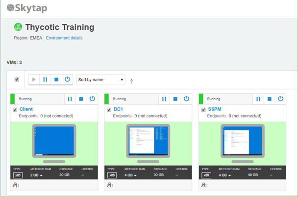
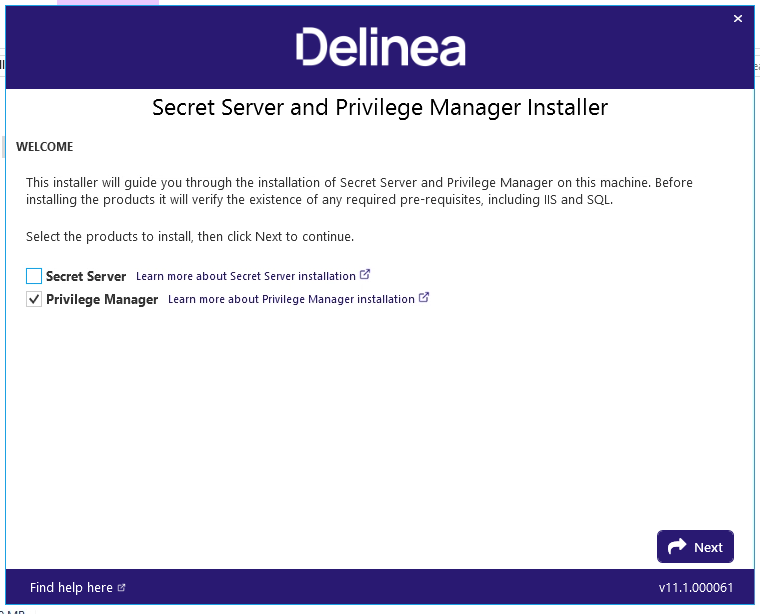
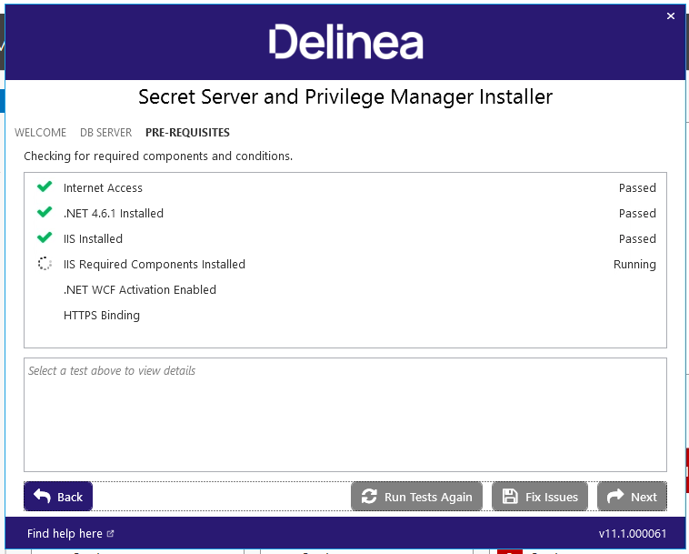
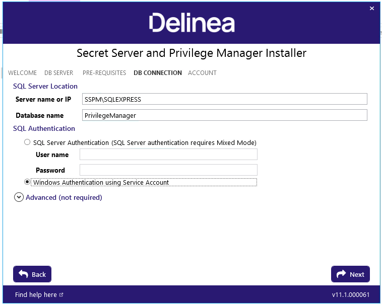
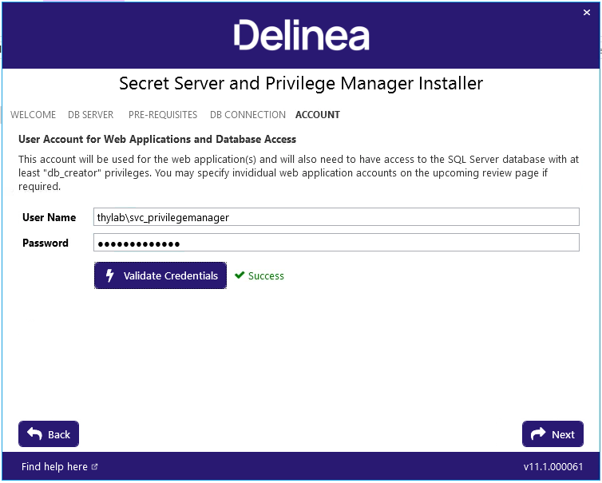
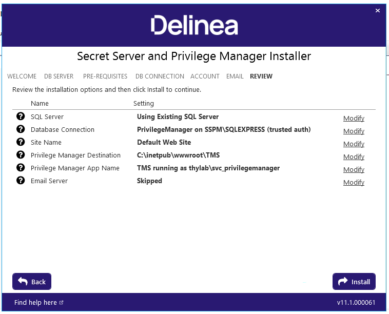
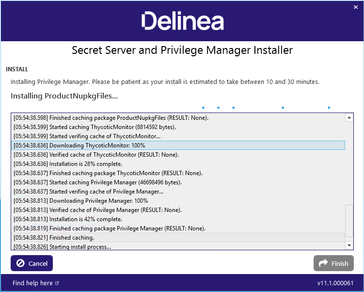

# Installing Privilege Manager

## Overview

This first module will cover:

1. What are the Secret Server components?
2. What are the pre-requirements (minimum and recommended)?
3. What ports does Secret Server use?
4. Lab exercises
5. Managing the Secret Server encryption key

### Privilege Manager components

- Front end ASP.NET web Application
- Back end SQL database

### Pre-Requisites

**Minimum Requirements - Basic Deployments**

| Web Server | Database Server |
|-|-|
|4 CPU Cores|4 CPU Cores|
|8 GB RAM|16 GB RAM|
|40 GB Disk Space|150 GB Disk Space|
|Windows Server 2012 R2 SP1 or newer|Windows Server 2012 R2 SP1 or newer|
|IIS 7 or newer|SQL Server 2012 or newer|
|.NET 4.5.1. or newer| |
|Powershell 3.0 or newer| |

!!!Note
    SQL Express is supported but not recommended for production environments

**Recommended Requirements - Basic Deployments**

| Web Server | Database Server |
|-|-|
|8 CPU Cores|8 CPU Cores|
|32 GB RAM|64 GB RAM|
|40 GB Disk Space|500 GB Disk Space|
|Windows Server 2016 or newer|Windows Server 2016 or newer|
|IIS 7 or newer|SQL Server 2012 or newer|
|.NET 4.6.1. or newer| |
|Powershell 5.0 or newer| |

### Lab Exercise 1 - Connecting to the lab environment

In this exercise will access the Delinea training lab environment.

1. Navigate to the URL of the training lab environment provided by the Delinea training team.

2. Enter the password that has been provided by the training team

3. You will now see all VMs in the lab. Some might be in a suspended state.

    

4. Click the power icon above the VMs to power them on, once powered on you can access each VM by clicking into the screen icon

5. Access the client machine and log in with the provided credentials.

!!!Note
    The labs have a default keyboard layout of UK English, you might want to select a different keyboard language in the Skytap toolbar (top of the screen after you have opened the GUI of the VM) and in Windows.

### Lab Exercise 2 - Installing Privilege Manager

In this exercise will power on and connect to the training lab environment before running through a complete installation of Privilege Manager.

01. Connect to **SSPM** using **adm-training** as the account and the provided password

02. On the desktop of the **SSPM** machine locate and open the *Installers* Directory on the desktop

03. Within the directory, navigate to *Privilege Manager > Delinea > Server*  (the installer is for both Secret Server and Privilege Manager)

04. Run the **DelineaSetup-11.2** file, when prompted with a windows User Account Control (UAC) dialogue click **Yes**

05. The installer can install both Privilege Manager and Secret Server in this lab we only want to install Privilege Manager so uncheck the Secret Server radio button as in the image below:

    

    !!!Note
        The installer, when internet is available, will automatically download and install the latest version of the software.

06. Click **Next**

07. On the SQL Server Database screen, we can either install SQL server express or connect to an existing database. In the lab environment SQL Express is already installed so select **Connect to an existing SQL server** then click **Next**

    

08. The installer will now perform a range of checks to ensure pre-requisites are in place. In the lab environment all requirements should be in place, click **Next**

    

09. On the next screen we need to configure the database connection. As the SQL server is installed on the same machine, in the Server name or IP field enter: **SSPM\\SQLEXPRESS** in the database name field, enter: **PrivilegeManager**

10. On the same screen we now need to configure the authentication option that will be used to connect to the database. Although we can use SQL authentication or Windows authentication here, Delinea recommend using Windows authentication. Select the Windows Authentication using service account radio button and click **Next**

    

11. On the next screen we will be asked to configure the service account that will be used to connect to the SQL database and used to run the IIS application pools. Enter the following credentials:

    * **username**: *thylab\\svc_PrivilegeManager*
    * **password**: *Provided by the trainer*

12. To ensure the credentials are correct, click **Validate Credentials**, if they are you should see the word success. If not, check the credentials for any errors. Click **Next**

    

13. On the next screen, options to configure an SMTP mail server are available. This feature will not be used during the training so click **Skip Email**

14. The next screen provides a review of configured installation options and the option to modify any options if required. Click **Install**

    

15. The installation process may take up to 10-15 minutes.

    

    !!!Note
        This is a great time to get some coffee or tea as waiting for 10-15 minutes for a process to end isn't great, but a necessity.)

16. Once the installation is complete click **Close**

### Lab 3 - Accessing Privilege Manager for the first time

1. While still on the **SSPM** VM, open Chrome (on your desktop) and navigate to the following URL: <https://sspm.thylab.local/TMS/PrivilegeManager>

    !!!Note
        As Chrome is not yet set as the default browser, click the **Set as Default** button and make Chrome your default browser. Close the setting windows and return to Chrome to cary on with the lab.

        The first time the page is opened it may take a few minutes for the UI is shown. IIS needs some time to build and start the needed files. During the first-time an account with local admin rights on the installation server (SSPM) will need to be used for authentication. Later other local/domain accounts or authentication options can be specified

2. On the **Getting Started** window, check *Do not show the Getting Started Banner* and click **Close**
