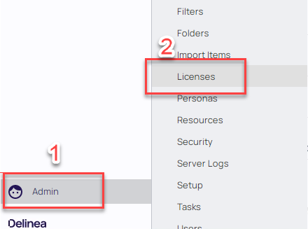
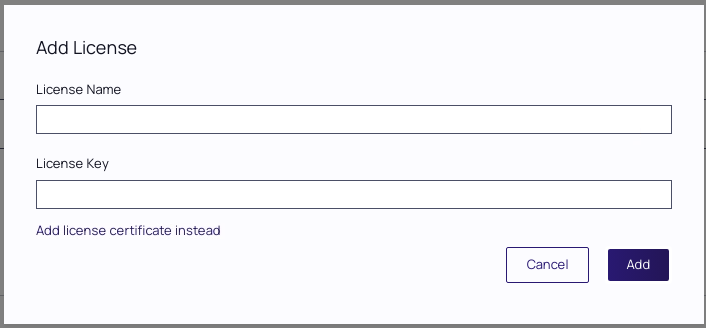

# Licensing Privilege Manager

## Overview

This module will cover:

1. How to install licenses

## Installing Licenses

Before any agents can be connected to privilege manager, valid licenses need to be added. Delinea license Client (Windows 10 etc. / MacOS). Your trainer will provide you trial licenses for use during the training.

!!!Note
   As we are currently using Privilege Manager in a stand-alone deployment, licenses will directly be added and managed within Privilege Manager. When Privilege Manager is integrated with Secret Server, licenses can be managed for both solutions within Secret Server which provides a centralizes license management mechanism.

### Lab 4 – Installing licenses

1. Ensure you are logged in to Privilege Manager with the **thylab\\adm-training** account

2. Click the **Admin** all the way to the bottom of the screen and select **Licenses**

      

3. From the license screen you will see that there are currently no licenses added. Click the **Add License** button

4. Enter the license name and key fields provided by your trainer, we will be adding two, separate license keys.

      

5. Click **Add**, you will be prompted with a message "License installed successfully" click OK

6. *Repeat* steps 4 and 5 for the second license key

7. Your lab environment is now licensed for Windows and Mac OS client endpoints
