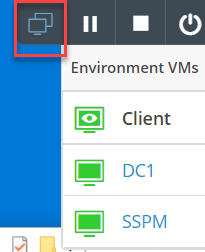
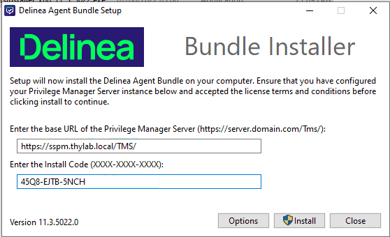
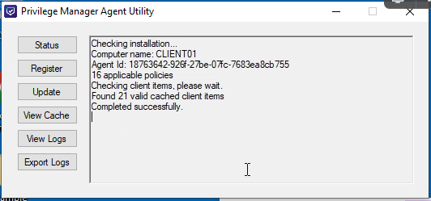

# Agent installation

## Overview

This module will cover:

1. An overview of the agent
2. How to install the agent using a command line and a MSI package
3. Install an agents
4. Check the installation of the agent


## Agent overview

The Privilege Manger agent provides flexible, lightweight endpoint connectivity. The agent checks for, evaluates, and applies the XML policies built within the Privilege Manager administrative console. The agent consists of three sub agents which can be installed collectively or as separate components if certain functionality is not required

- Core Delinea Agent (x64)
- Application Control Agent (x64)
- Local Security Solution Agent (x64):

The individual agent components can be installed at the same time using the bundled executable installer (.exe) or with individual installers (.msi) for each. This can be useful in situations where, for example a customer only wants to use the local security solution agent (local user and group management) but not apply application control.
The executable installer is designed to be run interactively by an end user and is typically used in testing, POV or lab environments. In production environments the .msi installers are normally used as they provide a more flexible way to centrally deploy the agent in several ways:

- software management systems
- GPO
- cloned (gold) images
- manually

All installers are available to download from

- <https://docs.delinea.com/privman>
- <https://www.ibm.com/support/pages/download-agents-privilege-manager-and-secret-server>

## MSI Installing

When using the .msi installers, installation strings can also be used to define several installation parameters, examples are provided below for reference:

**Core Delinea Agent**

```bash
msiexec.exe /i "DelineaAgent_x64_XXXXX.msi" /norestart AMSURL=https://SERVERNAME/TMS/ INSTALLCODE=XXXX1234ABCD REBOOT=ReallySuppress /qn
```

**Application Control Agent**

```bash
msiexec.exe /i "Delinea_ApplicationControlAgent_x64_XXXXX.msi" /norestart REBOOT=ReallySuppress /qn
```

**Local Security Agent**

```bash
msiexec.exe /i "Delinea_LocalSecurityAgent_x64_XXXXX.msi" /norestart REBOOT=ReallySuppress /qn
```

### Lab 5 - Bundle Agent installation

In this exercise we will be installing the executable, bundled agent installer onto the lab client machine.

01. Ensure you are logged on to the Client machine within the lab environment with the **adm-training** / *Provided Password by trainer* Credentials

02. Open the **Installers (sspm)** folder on the desktop navigate to **Privilge Manager > Delinea > Agent**

03. Run the agent installer, the agent installation dialogue will appear

    

04. In the **Base URL** field we will enter the URL of the Privilege Manager server **https://sspm.thylab.local/TMS/**

05. In the **Install Code** field, we will need to enter an installation code. This is a code generated within the Privilege Manager administrative console to ensure that rogue agents cannot be connected to a given instance.

06. From the Skytap toolbar connect back to the SSPM machine where the console is open

    

    !!!Note
            If the Skytap toolbar is not shown, click the *Down Arrow* to expand the tool bar at the top of your browser window.

            

07. In the Privilege Manager console, navigate to **Admin > Agents**

08. Select the **Installation Codes** tab

09. You will see a default installation code, manually copy, and paste into the Skytap clipboard, if this does not work, retry the copy/paste process.

10. Navigate back to the **Client** machine using the Skytap toolbar

11. Paste the installation code into the Install Code field like the image below (note: your installation code will differ)

    

12. Click **Install** and accept the UAC elevation request. The installation will take approx. 2 minutes.

    !!!Note
        In some rare cases the installation is erroring out. If that is the case, **restart** the Client VM and retry the installation. Most likely Windows Updates have been installed at the same time the installation took place. The restart will take approx 5-10 minutes in these cases.)

13. To complete the installation a restart is required. Click the **Restart** button. On restart the agent should now be successfully installed. The restart might take approx. 2 minutes.

### Lab 6 – Checking the agent installation with the Agent Utility

To ensure that the agent is successfully registered with the Privilege Manger server the Delinea Agent Utility can be used to very connectivity, check for new policies and various other tasks. The Agent Utility will be covered in more detail in various sections throughout this guide.

1. Ensure you are logged on to the Client machine as **adm-training** / *Provided Password by trainer* Credentials

2. Open **Windows Explorer**

3. Navigate to *C:\\Program Files\\Thycotic\\Agents\\Agent* and open the **Agent Utility** application

    

4. Accept the Windows UAC elevation prompt, The Agent Utility interface will appear

    

5. Click the **Status** button

6. The Agent should be registered with the server as well as successfully find several default policies

    

    !!!Warning
            If errors rise, most likely there is a typo in the base URL of the Server. This can be checked by looking at the URL that is being used by the agent in the Agent Utility when you click **Status**. If there is a wrong URL given, open **RegEdit** and navigate to **HKLM > Software > Policies > Arellia > AMS > baseURL**

7. Pin the Agent Utility to the taskbar for easy access in later exercises, by *right click the Agent Utility in the taskbar > Pin to taskbar*
