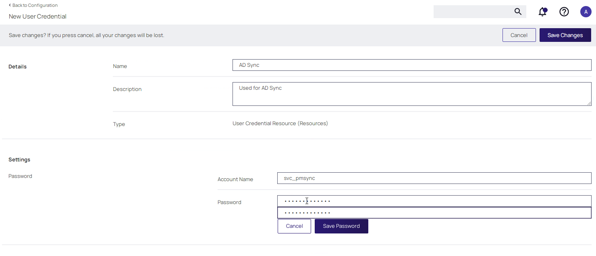
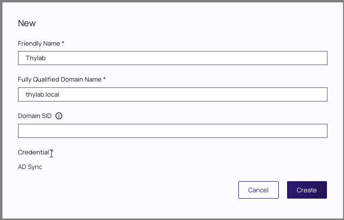
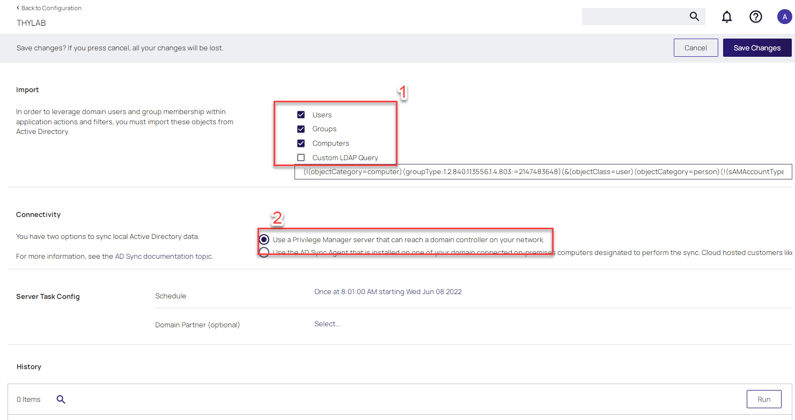
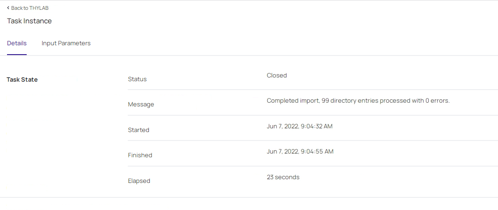
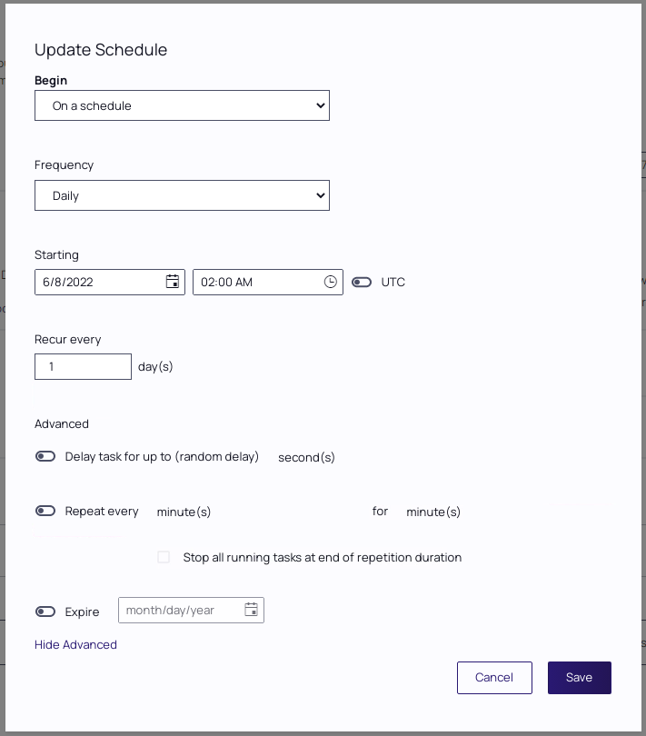
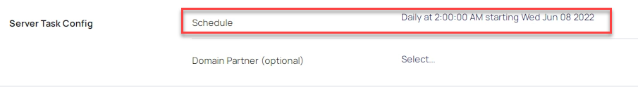
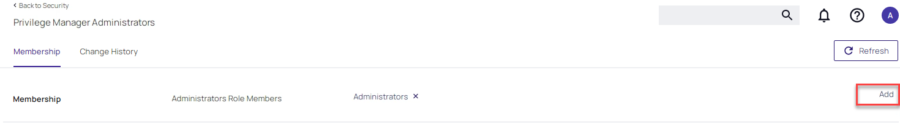
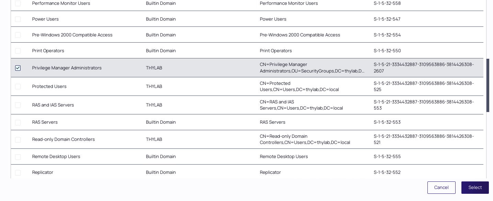
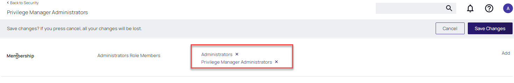

# Active Directory Integration

## Overview

This module will cover:

1. Configuring Active Directory Integration
2. Running initial AD Sync
3. Scheduling teh AD Sync Task
4. Roles (RBAC)
5. Adding users or groups to roles

## Introduction

At the point of installation, the local administrator’s group on the installation server is granted the administrator role within Privilege Manager. This means that users who do not have local admin rights on this server cannot currently log into the platform.

To provide broader user access, Privilege Manager can be integrated with Active Directory or Azure Active Directory so that users can log in with the standard AD or AAD identity.

Active Directory (or Azure Active Directory) integration also provides another huge benefit within Privilege Manager as policy filters can be created to target security groups and individual user accounts to ensure policies are only applied to the right users. This will be covered in a later module.

!!!Note
    Integrating Privilege Manager with Secret Server provides additional authentication options such as SSO via SAML and additional MFA options.

### Lab 7 - Configuring Active Directory Integration

01. Ensure you are logged in to Privilege Manager on **SSPM** with **thylab\\adm-training** / *Provided by the trainer*

02. Navigate to the **Admin > Configuration** page

03. Open the **Credentials** tab.

    !!!Note
        The first step in AD configuration is to create a credential that will be used to authenticate against and read from the Active Directory instance.

04. Click **Create** and use the following details:

    - **Name:** AD Sync
    - **Description:** Used for AD Sync
    - **Account Name:** svc_pmsync
    - **Password:** *Provide by trainer* (after clicking the *Edit* text)
    - **Second time Password:** *Provide by trainer*

    

05. Click **Save Password**

06. Click **Save Changes**

07. Click **Back to Configuration** (top of the middle pane)

08. Your just created *AD Sync* credential should be shown.

    !!!Note
        If you don't see the **AD Sync** credential refresh the browser

09. Next, we will configure the Active Directory instance settings, select the **Foreign Systems** tab

10. Select **Active Directory Domains**

11. Click the **Create** button

12. Use the following details for the opened window:

    - **Friendly Name:** Thylab
    - **Full Qualified Domain Name:** Thylab.local
    - **Domain SID:** Leave blank
    - **Credential:** AD Sync (click *Select* first)

13. Your configuration should match the image below

    

14. Click **Create**

### Lab 8 - Running an initial AD sync

Now that Privilege Manager has been integrated with an Active Directory instance, a synchronization task can be run. This task can also be scheduled to ensure Privilege Manager is constantly synchronized with changes that may occur within AD.

1. While still being in Privilege manager's UI as **thylab\\adm-training**, as you created the new Active Directory THYLAB

2. Select the *Synchronization* tab

3. In the **Import** section select **all but** the *Custom LDAP Query*

4. In the **Connectivity** section, leave the default. The other option is needed in situation where Privilege Manager can not directly connect to the AD environment that you want to synchronize with.

    

5. Click **Save Changes** and hit the **Run** button at the end of the page to start the first synchronization

6. A new screen will open. Wait till it says in the Message section *Completed import,.......*

    

### Lab 9 - Scheduling the Schedule for the AD Synchronization

In the previous lab we ran the initial sync of the Active Directory thylab.local. In the same screen where the details were given with respect to what needs to be synchronized and the way to connect to the Active Directory, the schedule is also found. The default setting is

- **Frequency:** Once
- **Starting:** *DAY of installation +1 day* - *Time of installation* *Not UTC*

It is important that the synchronization between Privilege Manger and Active Directory is performed on a regular schedule so that changes in AD are reflected.

To change the schedule of the synchronization, follow the below steps.

1. In the Privilege Manager UI, on the task execution page, click the **Back to THYLAB** text in the top left corner of the middle pane

2. Click the **Synchronization** and click the text **Once at XX:XX:XX AM starting XXX XXX XX XXXX text**

3. Use the following parameters for the fields:

    - **Begin:** On a schedule
    - **Frequency:** Daily
    - **Starting:** *\<THE DAY OF THE TRAINING +1 day>* - 02:00 AM - \<LEAVE UTC OFF>
    - **Recur every:** 1 day(s)

    !!!Note
            Under *Show Advanced* we have more detailed possibilities, like:

            - Delay task for not overloading the Domain Controllers with the synchronization queries
            - Repeat every x minutes for x minutes
            - Expire by date x

            We are going to leave them as they are. There might be situations where you may want to set these fields. A possibility could be that during a merge/consolidation or expansion of the ADs you want Privilege Manager to faster synchronize with AD.

            

4. Click **Save** to save the new schedule

5. Back in the Synchronization tab, click **Save Changes** to activate the new schedule which should be shown in the **Server Task Config > Schedule** section

    

### Lab 10 - Adding users and groups to Roles

Now that Active Directory has been synchronized, Active Directory users or groups can be assigned directly to Privilege Manager roles. There are a range of roles which provide granular levels of access the administrative console. The roles available out of the box are:

- Privilege Manager Administrators
- Privilege Manager Field Engineering
- Privilege Manager Helpdesk Users
- Privilege Manager MacOS Administrators
- Privilege Manager Users
- Privilege Manager Windows Administrators

!!!Note
    If Privilege Manager has been integrated with Secret Server, users and roles can be configured directly in Secret Server for a single configuration point for authentication and access.

01. Navigate to **Admin > Security > Roles**

02. Select the **Privilege Manager Administrators** Role

03. By default, only the local administrators group on the installation server is included in the Administrator role.

    

04. Click the **Add** text towards the end of the line which shows *Membership*

05. Click **Search**

06. Change *items per page* to **100** at the bottom of the screen

07. Select the **Privilege Manager Administrators** group by selecting the checkbox in front of the group

    

08. Click **Select**

09. The *Privilege manager Administrators* group should now be the only one mentioned in the **Membership** section

    

10. Click **Save Changes**
