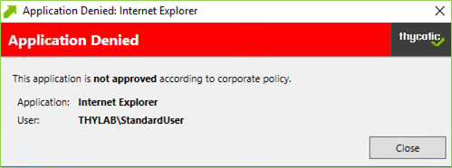
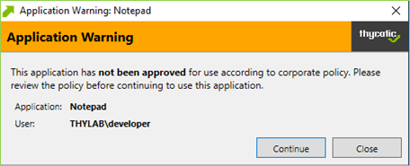
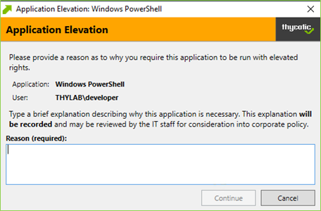
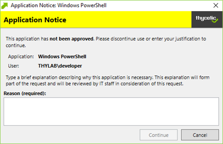
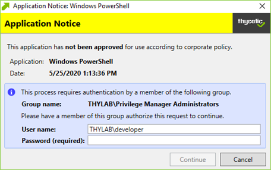
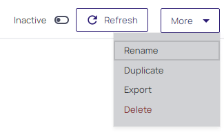

# Understanding Privilege Manager Policies

## Overview

This module will cover:

1. Policy Overview
2. Creating a blank policy
3. Policy Components

## Policy Overview

In this module we will be exploring how Privilege Manager policies are used to control application behavior. A policy is an XML file that is contains filters, conditions and other settings that is created and cached on the Privilege Manage server, the endpoint agent calls in to the server on a configurable, regular schedule (every 30-60 minutes by default).

Typically, policies are used to achieve the following:

- Elevation – Allowing applications to run with elevated privileges
- Denylisting - Blocking applications from being executed
- Allowlisting Allowing applications to run with standard user rights (allowlisting)
- Execptionlisting - Catching unknown applications that have not been explicitly elevated, blocked or allowed

The above outcomes can be achieved seamlessly, so the action to elevate, block or allow happens seamlessly to the end user, or with customizable messaging which provides additional functionality.

### Application Denied Message

When blocking an application from being executed, users should always be shown a message that lets them know that the application has been blocked. If no message is displayed, users will not typically understand what has happened and may raise a support case unnecessarily.

### Application / Elevation Warning Message

A warning message can be used to let the user know that the application will be executed or executed with administrative rights, this is useful in preventing applications from self-executing as the interactive user will need to allow the execution by accepting the warning prompt.

### Justification Message

Justification messages only let the user proceed with the execution or elevation of an application once a justification has been provided. This provides a useful way of collecting qualitative data that demonstrates the reasons users are running applications. This information can subsequently be used to inform how future policies are created.

### Approval Message

An approval message provides an application execution/elevation workflow, if this message type is used, users will only be able to execute or elevate the application if a user with access to the Privilege Manager administrative console approves the execution. This approach is covered in more detail later in this training course.

### Group Authenticated Message

The group authenticated message will only allow the user to proceed with an application execution/elevation if they are a member of a domain group specified within the message settings. This can be a useful way of allowing support desk representatives to help end users without the need for administrative privileges.

### Lab 15 - Creating a Blank Policy

In this exercise we will create a new, blank policy so that we can explore the components that make up the policy in detail.

1. In the Privilege Manager UI navigate to **WINDOWS COMPUTERS\*\*(click on the downward pointing arrow) \*\*> Application Policies**

2. Click **Create Policy**

3. Click **Skip the wizard, take me to a blank policy** at the bottom of the middle pane

4. Provide the following as parameters for the fields:

   - **Name:** New Test Blank Policy
   - **Description:** Blank policy to run through the components of a policy
   - **Priority:** 300

5. Click **Create Policy**

## Policy Components

In this section we will explore the individual components that make up a Privilege Manager policy.

Let's look at all the possible settings and walk by them one by one...

### General Settings

On the right hand side of the screen:

- Using the toggle switch the policy gets activated or inactivated.

- Under the **More** button, there are possibilities for:

  - Rename the policy
  - Duplicate the policy
  - Export the policy as an XML file
  - Delete

  

#### Policy details section

- Computer Groups Targeted; the group(s) of Windows Machines (as we are in that group) that are impacted by the policy

- Deployment of the policy; shows highly important information about the deployment state of a given policy. If the policy is enabled, then the deployment tab shows the following fields:

  - Policy Modified

    - Shows the date and time of the last time the policy was modified

  - Total Resources Targeted

    - Shows the total number of devices that should receive this policy. This is based on the resource targeting filter applied to the policy

  - Resources with Latest Version

    - Shows the total number of devices that have the latest version of the policy.

- Last Modified; when has the policy been modified last?

- Priority; an integer. Privilege manager evaluates policies in a specific order based on the priority value. Policies are evaluated from low to high with 1 being the lowest priority. Policy priority is incredibly important and will be discussed, in detail as we start to create policies in subsequent exercises

- Description; high level explanation of what the policy does and is used for

#### Conditions section

- Application Targets; are the applications we want to target within the policy. Application filters can be created in four ways:

  - Out of the box filters – Privilege Manager comes with a range of out of the box filters for common Microsoft and third-party applications
  - From collected events – Application filters can be built directly from events collected by Privilege Manager
  - From file upload – applications can be uploaded directly to Privilege Manger and then added to filters
  - Manually Created – New filters can be created manually from the Admin > Filters area

- Inclusions; provide an additional filter statement that ensures the policy is only applied if **ALL** added inclusion filters are met. For example, a user context filter could be added to the inclusion filters to ensure the policy only applies if the user is a member of a specified domain group.

- Exclusions; provide an additional filter statement that ensures the policy is not applied if **ANY** of the added exclusion filters apply. For example, a user context filter could be added to the exclusion filters to ensure the policy does not apply if the user still has admin rights.

#### Actions section

- Actions; are the things we want to do when the policy matches and is therefore applied. There are an extensive range of actions available out of the box, in addition custom actions can also be created. Out of the box actions include the ability to add admin rights, display a range of messaging, deny application execution and many more.
- Child Actions; are things that need to be done if the process that is spawned from the first action. Example; Notepad is run with elevated rights, should it then keep those rights for the files that it opens?
- Audit Policy Events; should the activities that are detected by the policy been fed-back into the system or not? Example; For new installation, we want to see which applications are run by users with elevated rights (UAC screen shown). The next Module will use this example and provide a step by step guide to create a policy for such a use case.

#### Policy Enforcement (when clicking on the **Show Advanced** text at the bottom of the page)

Policy Enforcement settings determine how the policy is evaluated in several different ways.

- Continue enforcing policies after enforcing this policy

    If enabled, this setting means that even when the policy applies, Privilege Manager will continue evaluating other policies within the policy set. In production environments this setting is rarely used. In most cases if a policy matches an application filter and other conditions, then the policy actions should be applied.

- Continue enforcing policies for child processes after enforcing this policy

    If enabled, this setting means that even when the policy applies, Privilege Manager will continue evaluating other policies within the policy set, if no other policy applies then the actions of the policy will be applied. As an example. We may want to pass child processes back through a denylist filter to ensure users cannot circumnavigate a blocked application by running it as a child process of an allowed application.

- Stage 2 processing

    If a policy is marked as a stage 2 processing policy, then Privilege Manager ignores the policy on the first two passes through the policy set as would be the case in the first two examples above. This is commonly used with catchall policies that would match on any application. If passing child processes back through a policy set to evaluate against a denylist, we would not want the application to match against the catchall policy.

- Applies to all processes

    By default, Privilege Manager policies do not apply to processes running with the System context. This protects the operating system and helps to mitigate against the risk of a policy inadvertently blocking a required system process. Enabling this setting will change this default behavior so that system processes are evaluated against the policy. This setting should be used with extreme caution and is not typically required in most deployments.

- Skip Policy Analysis at Start-up

    This setting can be used if a policy set is causing a delay to machine boot times. It simply means that the policy will only be evaluated once all windows boot tasks have been completed. This setting is not normally required.

### Policy Events

If the policy has the **Audit Policy Events** set to active, here the events will be shown that have been triggered by the policy. You can change the time window by clicking on the (default) **Past 3 months** text and make your changes. Using the **Refresh** button you can refresh the latest data from the Database as the agents work in an A-Synchronous way with respect to sending data back to the server.

### Change History

This tab show the history of the Policy and who has done what with respect to changing the policy. Clicking an item will provide more detailed information.

