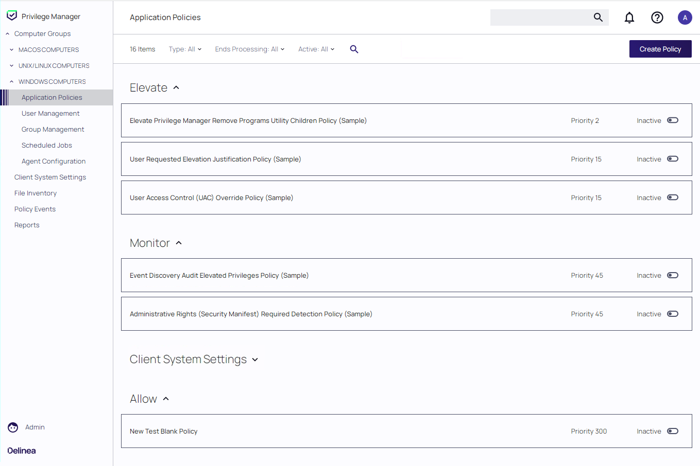
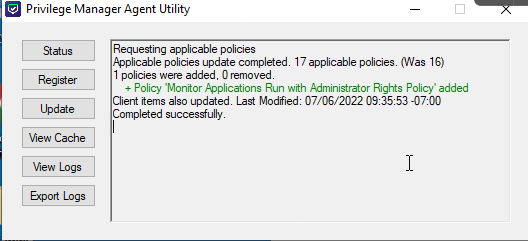
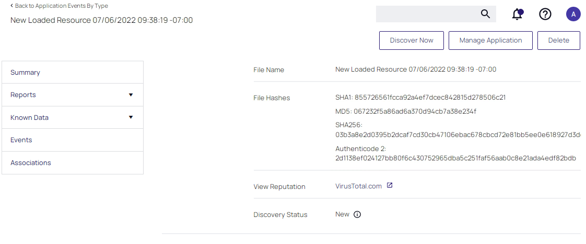
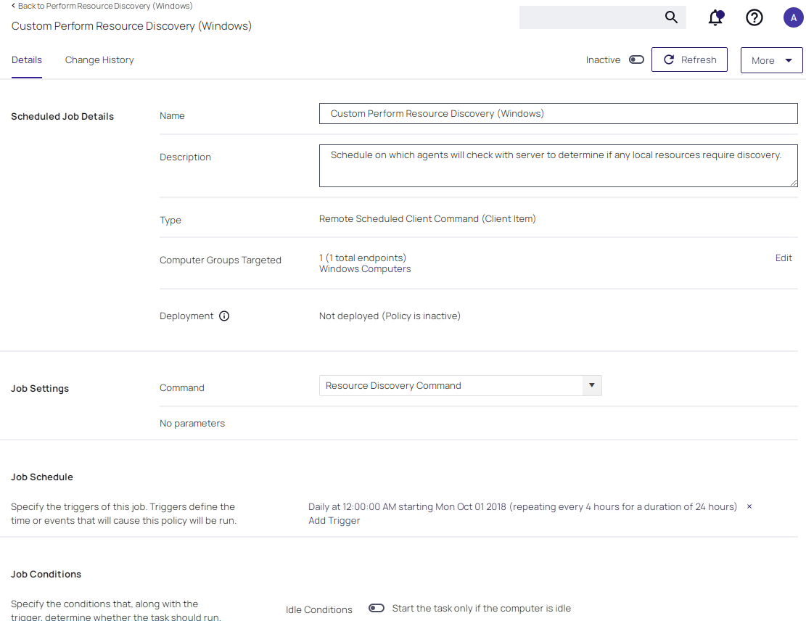

# Policy events

## Overview

This module will cover:

1. Least Privilege Approaches
2. Choosing A Suitable Deployment Approach
3. Enabling and Testing Event Discovery Policies
4. Understanding Privilege Manager Events
5. Discovering New Loaded Resources

## Least Privilege Approaches

One the key aims of a Privilege Manager implementation is to create a ‘Least Privilege’ environment where local administrative rights are removed without impacting the productivity of users. This can be a challenge as many applications require admin rights to function so removing admin rights before having policies in place to elevate applications on behalf of users would potentially mean users have applications that they are unable to use.

To mitigate this impact to productivity there are two broad approaches that can be implemented

- Event Discovery

  - Users are left with admin rights during a ‘discovery phase’
  - Policies are deployed that target applications that require administrative privileges and generate audit events
  - Events are used to build elevation policies
  - Elevation policies are enabled, and admin rights can safely be removed

- On Demand Elevation

  - Admin rights are removed from a pilot group
  - Policies are deployed that allow users to elevate applications on demand using the right-click run as administrator option in the windows context menu option. When this occurs, auditing events are generated
  - Events are used to build elevation policies
  - On demand elevation can be restricted or removed

!!!Note
    These approaches can also be used together. A discovery phase can be used before moving to an on-demand elevation model.

## Choosing A Suitable Deployment Approach

Either approach can be used to successfully implement a least privilege environment. There are, however, several factors that should be considered and discussed with the customer to ensure an appropriate approach is used, based on the customer requirements. Differences in these approaches are summarized in the table below:

| |Event Discovery|On-Demand Elevation|
|-|-|-|
|**User Impact**| Very Light Touch (users retain admin rights during discovery phase)| More impactful to users as admin rights are removed from users during pilot phase|
|**Timeframe**|Takes longer to remove admin rights as users need admin rights during discovery phase|Admin rights can be removed from start of pilot phase|
|**Data**|Data collected is only quantitative (Users ran application X, X number of times)|Can provide quantitative data and qualitative data (justification messaging can be used to ask users why they are running applications)|

Let us consider two example scenarios and how we might decide on an approach.

**Example 1:**

 Customer needs to remove admin rights as soon as possible to meet a compliance audit deadline.

In this scenario, as timeframe is the key factor, the on-demand elevation approach would be a good match.

**Example 2:**

 Customer is working with end users that are very resilient to change and do not want to have admin rights removed

In this scenario, as user impact is the key factor, the event discovery approach would be a good match

### Lab 11 - Creating a *Run with Administrator rights* policy

Creating a policy that will catch the events for applications that have been run with elevated rights (administrator rights) are important to understand. They can have a big impact on the users doing their day-to-day job. This lab will show how a basic policy can be built just for that purpose.

01. In the Privilege Manager, navigate to **Windows Computers > Application Policy** as we have an agent installed on a Windows machine.

    !!!Note
    If you don't see the Application policies, expand the **Windows Computers** group by clicking on the **small arrow pointing down**.

02. In the right pane you already see some example polices mentioned.

    

03. Click **Create Policy**. Is this lab we are going to use the *Wizard* driven version. You can also start from scratch, we are going to use that later on in the lab.

04. Click **Monitoring**

05. Click **Next Step**

06. Click **Applications Run as Admin**

07. Click **Next Step**

08. Provide the following parameters for the fields:

    - **Name:** Monitor Applications Run with Administrator Rights Policy
    - **Description:** Monitors the execution of applications that are run with Administrator Rights.
    - **Priority:** 100

    !!!Note
        To read more detailed information on priority and policies read this article which describes in depth the why, how and what. <https://docs.delinea.com/privman/11.2.1/computer-groups/app-control/policies/priority.md>

09. Click **Create Policy**

10. Click the **Inactive** switch to activate the policy The Inactive should change to **Active**. The policy is ready to be deployed and tested

### Lab 12 - Testing the *Run with Administrator rights* policy

Now that policy has been enabled, we will move the client machine, ensure that the newly enabled policy has been applied and execute applications that should be picked up by the discovery policies.

1. Connect to the Client machine with the **thylab\\adm-training** / *Provided by trainer* Credentials

2. Open the **Privilege Manager Agent Utility** (pinned to the taskbar in an early exercise or navigate to **C:\\Program Files\\Delinea\\Agents\\Agent\\Agent Utility.exe**)

3. Accept the UAC elevation prompt

4. Click the **Update** option, the newly enabled discovery policies should now be applied

    

5. Close and reopen the **Agent Utility** application (this application requires admin rights so should match the policy)

6. Open the **Example Applications** directory on the desktop, run the **Notepad ++ (npp.7.8.6.Installer.x64) installer**, this installer requires admin rights and should match the policy. Just start and stop the installation after the UAC has been shown by clicking the **Cancel** button.

## Understanding Privilege Manager Policy Events

Return to the SSPM server and open the Privilege Manager UI and click the Logo and Text Privilege Manager (top left navigation bar) to open the home screen. Within a few minutes, applications that are being matched against a Privilege Manager policy that is set to capture policy feedback, events will be visible in the Privilege Manager console, you have to scroll down until you see the **EVENT SUMMARY** widget

These events can be viewed in various ways, applications that require admin rights will also be visible in the **Top Applications Needing Elevation** view

You will notice that these applications initially appear in the console as a **New Loaded Resource**. This is because when an application is matched against a policy the Privilege Manager agent records the hash of the application and the file path only. This information is then sent back to the server where a task is executed to see if that application has previously been seen and therefore additional data such as filename, certificate etc. is already present within the Privilege Manager database. If it is, then the application information would immediately be available and would not appear as a *New Loaded Resource*, if the application has not been seen previously, then a task is created and assigned to a machine where that application has been executed to run inventory and retrieve the additional information.

This approach provides a highly scalable approach to event collection, as it means that duplicate information is never stored in the Privilege Manager database, if the application has previously been discovered only the Hash and file path is collected. This does however mean that events may appear as 

*New Loaded Resources*

 for a period of time. In the next exercise will explore how these events can inventoried in a shorter time frame.

### Lab 13 - Discovering New Loaded Resources

There are two ways that *New Loaded Resources* can be discovered, either by running a manual inventory task or waiting for the automated task to run which by default runs every four hours on managed machines.

#### Manually discover a New Loaded Resource

1. From the Privilege Manager Console, click the first number in the **Events Summary View**

    

2. Click the first of the **New Loaded Resource** items

3. Your view will look something like the image below

    

4. Click the **Discover Now** button

5. As you can see in the Discovery Status field, the task has already been assigned to the agent on **CLIENT01**, running the **Discover Now** button will trigger the agent on this machine to run the task immediately rather than waiting for the next scheduled instance of the task to run

6. Click **Back to Application Events By Type** in the top left corner of the middle pane

7. There should not be any **New Loaded Resource** left as the Discovery has run against all.

    

    !!!Note
        Remember we ran JUST on CLIENT01 and not on other machines. The **Discover Now** will run against all NON discovered applications.

8. These application events can now be used to build filters which can be added to various policies, this will be covered in later modules

### Lab 14 - Increasing resource discovery frequency

In testing, POC, and pre-production environments it can be advantageous if event discovery is occurring quickly so that the information provided can be used to build policies in a timely fashion.
| In this exercise we will create a copy of the built-in policy that is used to trigger the resource discovery task so that the schedule can be changed. The schedule cannot be changed on the default policy as it is read-only.

01. In the Privilege Manager console, navigate to **WINDOWS COMPUTERS > Scheduled Jobs**

02. Click the **Magnifying Glass** and type *Perform*

03. Click on the Job Name *Perform Resource Discovery (Windows)*

04. Click the **Active** switch to make it **Inactive**

05. Click **Duplicate** so we can crete our own schedule for the Discovery

06. For the **Name** field, use **Custom Perform Resource Discovery (Windows)**

07. Click **Create**

    

08. In the **Job Schedule** section Click on the existing **Schedule**

09. Click the *Show Advanced* text

    !!!Note
        You will note that the default schedule means that the task runs every 4 hours but with a random delay of up to 4 hours. This means that task could run at any point every 4-8 hours. This random delay is important as it ensures that all endpoints do not trigger the task at the same time which could cause performance issues or even service interruption

10. Change the **Delay task for up** to value to *2* minutes

11. Change the **Repeat every** value to *4* minutes

12. Click **Save** to save the schedule

13. Click **Save Changes**

14. The **Job Schedule** section should now mentioned the repeating of 4 minutes

    

15. Click **Inactive** so the Job becomes **Active**

16. This now means that the longest it should take for a **New Loaded Resource** to be discovered is a maximum of 6 minutes

