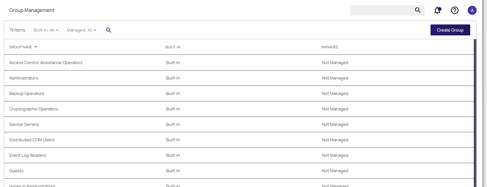
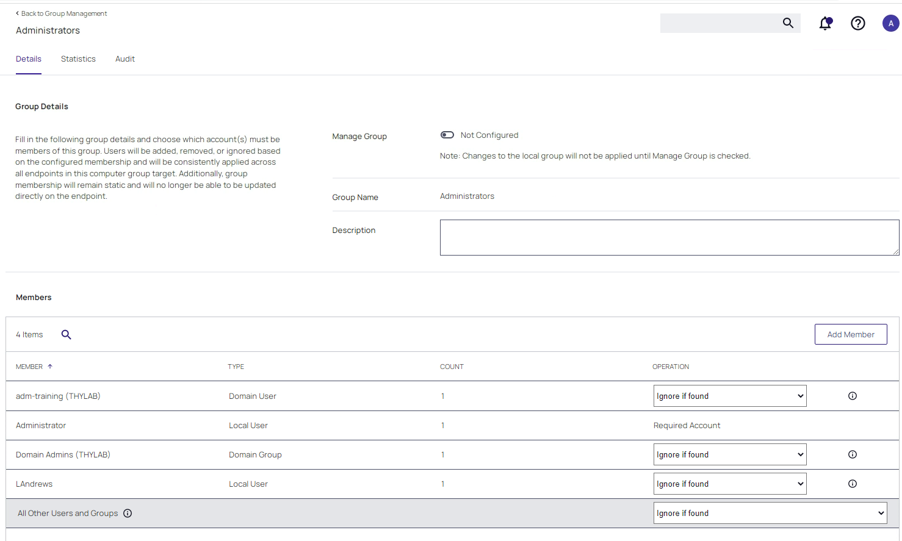
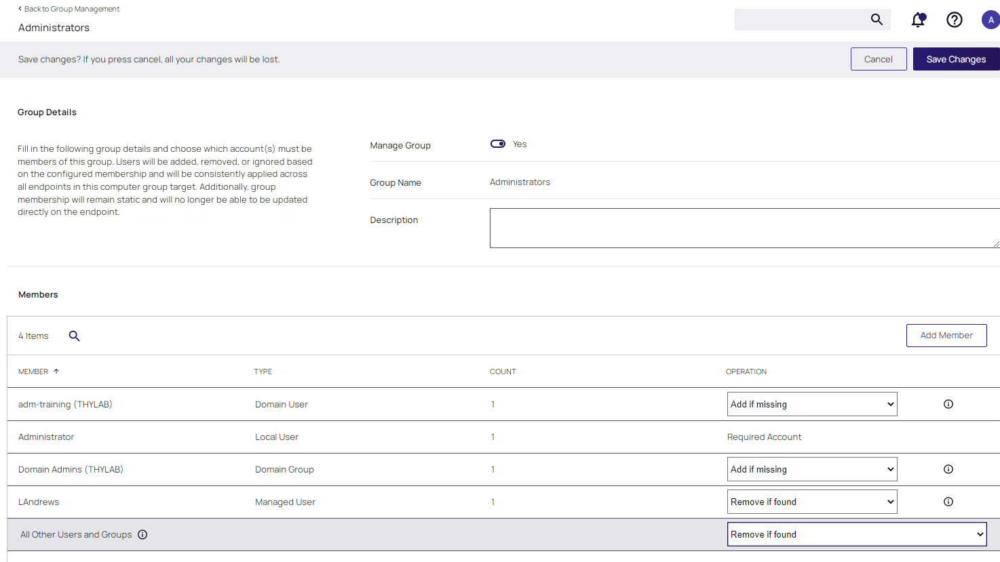
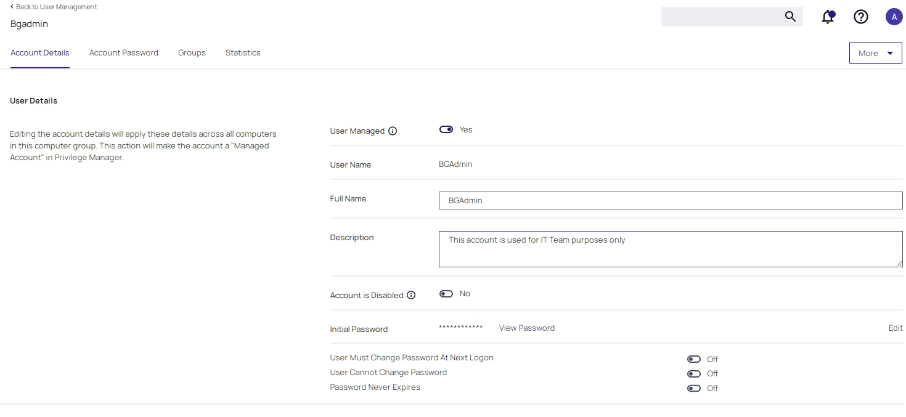
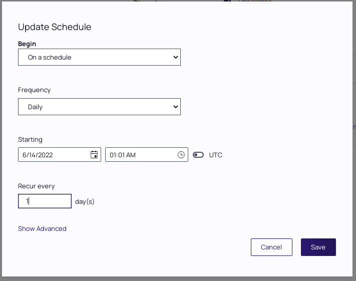
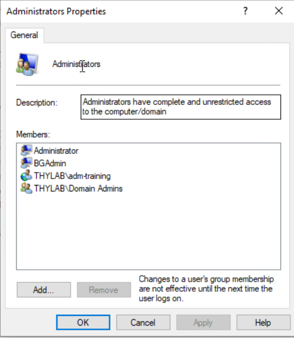
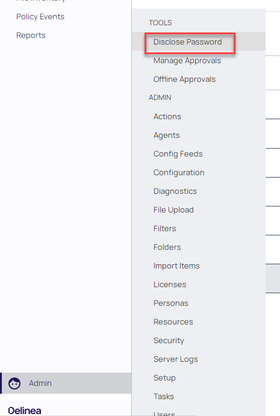
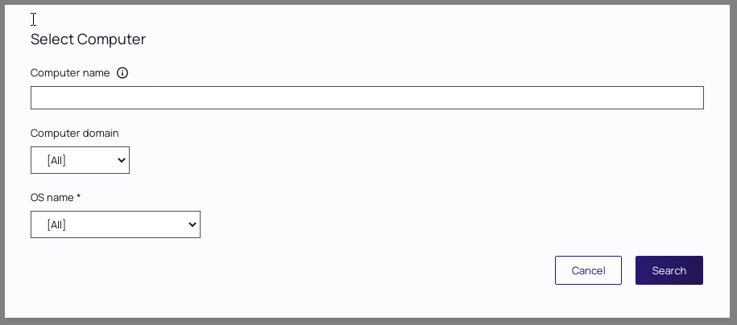
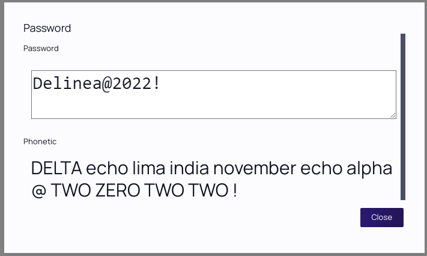

# Local Security Solution

## Overview

This module will cover:

1. Viewing Endpoint Privileges
2. Controlling Local Privileges
3. Provisioning managed Users

Privilege Manager also includes an additional solution which provides the following functionality:

- Gain complete visibility of endpoint privileged users and groups
- Add and remove privileges from existing users
- Provision new users and groups
- Create, rotate, and disclose local passwords

In this module we will explore the above functionality to provide a complete endpoint privilege management solution.

## Viewing Endpoint Privilege

Most organizations do not have an accurate picture of which users do and do not have elevated privileges across the corporate endpoint estate. Even if organizations are using tools such as Active Directory Restricted Groups, this might not allow for control or visibility of non-domain joined machines.

When the Privilege Manager and LSS agents are deployed to endpoints, within minutes a local inventory of privileged users and groups is performed. This information is then sent back to Privilege Manager so that a centralized, consolidated view of local privilege can be obtained.

### Lab 24 - Viewing Local Privileges

1. Open SSPM and navigate to **WINDOW COMPUTERS group > Group Management**

2. This page shows all discovered Local groups on the Windows Machines.

3. The three Columns are:

      1. GROUP NAME - Name of the discovered group
      2. BUILT-IN - Defines if this is a built-in group of Microsoft Windows, or User Defined
      3. MANAGED - If the group is under control of Privilege Manager or not.

      

4. Click the **Administrators** group and see what information is being showed. Don't change anything as we will do so at a later stage of this module

      

## Controlling Local Privileges

For most organizations, as well as building policies within Privilege Manager that will ensure that users can perform their job role without the need for an administrative account, they will need also require a means of removing admin rights from users. They will also need a secure mechanism to ensure that, once removed, users cannot regain admin rights without approval.

Privilege Manager provides this functionality, in the following lab exercise we will view users that currently have administrative rights, remove admin rights from a specific user and apply controls to ensure users cannot regain access to the local admin group.

### Lab 25 - Removing and controlling Privileges

#### Setting the Privileges policy

01. Back in SSPM, in the **Administrators** group we can see that account *LAndrews* is part of this group.

02. Navigate to **WINDOW COMPUTERS group > User Management**

03. Select account **LAndrews**

04. Check the **User Managed** toggle switch

05. Set the **Initial password** by clicking the **Edit** text to **Delinea@2022!**. You have to provide the password twice!

06. Click **Save Password**

07. Click **Save Changes**

08. Navigate to **WINDOW COMPUTERS group > Group Management**

09. Click the **Administrators** group

10. Click **Manage Group**

11. Make the following changes to the **Members** section:

    - LAndrews - change *OPERATION* to **Remove if Found**
    - All Other Users and Groups - change *OPERATION* to **Remove if Found**

    

12. Click **Save Changes**

13. In the *Manage Group* windows click **Yes**

#### Testing the policies

01. Switch to the client machine CLIENT01
02. Log the current user off and log in as **Developer** / *Provided by the trainer*
03. Open mmc.exe from the start menu
04. Add the **Local Users and Groups** snap-in and keep the Local machines as the target
05. Open **Groups > Administrators**
06. Notice that *LAndrews* is in the Administrators group
07. Update the policies on the client from the **Agent Utility** (due to policies you will get the Warning message, click **Continue**). The two new created policies will be shown in green.
08. Back in the MMC, click the Groups and the **Refresh** button
09. Open the Administrator Group and notice that *LAndrews* is **no longer** in the Administrators group
10. Try to add a user to the Administrators group, it will be denied by the system

## Provisioning managed users

In some cases, organizations may want to keep an Administrative account for break-glass purposes. Although this is typically not required with a good Privilege Manager policy set. Deploying accounts of this type is incredibly difficult without a solution like LSS for the following reasons:

- Deploying a single administrative account to large numbers of machines with the same password on each machine is incredibly insecure. It allows for open lateral movement should the account fall into the wrong hands.
- Deploying an individual, unique administrative account to each endpoint is difficult to deploy and manage.

The Privilege Manager local security provides a complete solution to this problem that provides to following granular functionality:

- Deploy an account to a specific group of machines created within the solution
- Set an initial password
- Manage the password so it is rotated on each individual machine on a defined schedule
- The credential for a specific machine can be disclosed from the Privilege Manger console at any time from the **Admin > Tools > Disclose Password**

In the following lab exercise, we will deploy a break-glass admin account which will have the password rotated on a regular schedule. We will also disclose the password for this account.

### Lab 26 - Deploying a "break glass" administrative account

#### Creating the Managed Account - Part 1

01. Back in SSPM, in the **Administrators** group we can see that account *LAndrews* is part of this group.

02. Navigate to **WINDOW COMPUTERS group > User Management**

03. Click **Create User**

04. Call the account **BGAdmin** (which stands for break glass admin)

05. Click **Create**

06. Toggle **User Managed** to yes

07. Add a description: *This account is used for IT Team purposes only*

08. In the Initial Password field, click the **Edit** text

09. Enter an initial password of: **Delinea@2022!**

10. Confirm the password

11. Click **Save Password**

12. Click **Save Changes**

    

13. Click the **Account Password** tab

14. Click the **Password Managed** toggle switch

15. In the *Confirm Manage Password* screen click **Confirm Manage Password**

16. Optionally, configure the password complexity requirements

17. Ensure the **Log Password Before Change** option is checked. This option is very important and means that a new random password will not be set until it has been logged in Privilege Manager. This avoids the risk that a new password is created but is not available to disclose.

18. Click the purple, update schedule to configure and change the schedule to rotate the password every day 01:00 AM.

    

19. Click **Save**

20. Click **Save Changes**

#### Creating the Managed Account - Part 2

Now that the BGAdmin account has been created we need to assign it to the correct group.

1. Navigate to **WINDOW COMPUTERS group > Group Management**
2. Open the **Administrators** group and click the **Add Member** button
3. Select from **Type** *Local User*
4. Then select the **BGAdmin** account and click **Add Member**
5. Check that in the OPERATION column the option **Add if missing** is shown for the BGAdmin user
6. Click **Save Changes**

#### Testing the Managed Account

Now that all is ready to be tested let's start testing...

1. Switch to the client machine CLIENT01

2. As the MMC is still open, refresh th Groups and see if BGAdmin is mentioned in the Administrators group. It should not be as we haven't updated the policy yet.

3. Update the policies on the client from the **Agent Utility**. The new created policy will be shown in green.

4. Back in the MMC, click the Groups and the **Refresh** button

5. Open the Administrator Group and notice that *BGAdmin* is in the Administrators group

      

6. Close all open windows and click No in the MMC message if you want to save the MMC configuration

#### Break glass password retrieval

Now we have seen the user in the machine in the correct group as defined in the policy, now let's get the password so we could use that if needed in a Break glass scenario.

1. Switch back to SSPM

2. Navigate to **Admin > Tools > Disclose Password**

      

3. Click the **Select...** text

4. Click the **Search** button

    !!!Note
            As we only have one client this is easy, if there would be a lot of machine reporting into Privilege Manager, you can search on the Clinet's name, Computer Domain or OS Name.

    

5. Click **CLIENT01**. In the page that appeared you will see the two accounts (*LAndrews* and *BGAdmin*) that are being managed by Privilege Manager

6. Click on **View Password** to see the password of **BGAdmin**

7. This shows the initially set password. The password rotation has not been run yet.

      

8. Click **Close**
