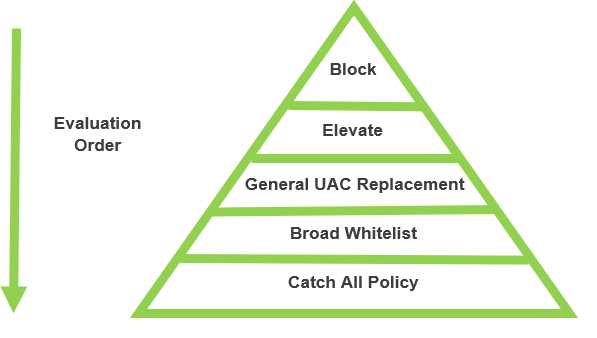

.. _m7:

---------------
Global Policies
---------------

Overview
------------

This module will cover:

1. Policy Creation Methodology
2. Backlisting (blocking application execution)
3. Executable Elevation Policies
4. Installer Elevation Policies

Policy Creation Methodology
---------------------------

A general rule of effective policy creation (although there are exceptions) is that individual policies should be structured from the most granular down the broadest **catch all** policies. Similar approaches are typically used when creating firewall rules as a point of reference. 
The diagram below illustrates this concept:
 

.. note::
     A key principle of effective policy design is to ensure that any given application cannot pass through the policy set without, at the very least, matching against the catch all policy. 

In the following lab exercises we will now create a range of policies based on the principles explained above but also taking into consideration the fact that most organizations have multiple types or communities of users who require different types of endpoint experience. 

Backlisting (blocking application execution)
---------------------------------------------

Creating a policy to prevent applications which are known to be malicious or inhibit user productivity is a very common use that can easily be fulfilled with Privilege Manager. When creating a blacklisting policy, it will typically be the first policy in the set with the lowest priority level. This avoids any risk of any other policies inadvertently allowing an application to run which we intent to block. 

.. note:: 
    Although deploying blacklisting policies is common, it is important to note that blacklisting on its own is not an effective approach to creating a secure endpoint application environment. The reason for this is that a blacklist represents a point in time snapshot of applications. There are constantly new, unknown applications that cannot be targeted. In further modules we will explore how a combination of blacklisting, whitelisting and greylisting can be used to create a secure environment. 

Lab 15 - Creating a blacklisting (blocked application) policy
*************************************************************

Before starting the lab exercise, we will disable the **Monitor Applications Run with Administrator Rights Policy** we created earlier in Module 6 as the policy set we are creating will also capture valuable discovery events. To disable this policy
#. Navigate to **WINDOW COMPUTERS group > Application Policies**
#. Search the **Monitor Applications Run with Administrator Rights Policy** and click the toggle switch so it shows **Inactive**

   .. figure:: images/lab-pv-002.png

We are going to use the Wizard again to create the blocking policy to not allow the use of Internet Explorer and show a message that the application is not allowed.

#. Click **Create Policy**
#. Click **Controlling** and click **Next Step**
#. Click **Block** and click **Next Step**
#. Click **Notify and Block** and click **Next Step**
#. Click **Executables** and click **Next Step**
#. Click **Existing Filter** and click **Next Step**
#. In the new screen, use the Magnifier Glass and type *Internet* and click the **Add** text in the line where you see Internet Explorer
  
   .. figure:: images/lab-pv-003.png

#. Click **Update**
#. Click **Next Step**
#. Use the following parameters for the fields:

   - **Name:** Global – Blocked Applications
   - **Description:** This policy blocks defined applications for all users 
   - **Priority:** 1

#. Click **Create Policy**
#. Activate the policy by clicking the **Inactive** toggle switch

To test the policy we are going to login to the **CLIENT01** machine.

#. Switch to the CLIENT01 machine
#. Sign out the current user, by clicking on the 
#. At the login screen, click **Other user**
#. Use **standarduser** / *Password provide by trainer*
#. Navigate to **C:\\Program Files\\Thycotic\\Agents\\Agent** and double click **Agent Utility**
#. In the UAC screen use the **thylab\\adm-training** user and corresponding password to run the application. The StandardUser is NOT an administrator on the VM

   .. figure:: images/lab-pv-004.png

#. In the Agent Utility click the **Update** button to get the latest policies. The newly created policy should be shown in green

   .. figure:: images/lab-pv-005.png

#. Try to open Internet Explorer by using any know method.
#. The start of Internet Explorer should trigger the block policy and show an **Application Denied** message as shown below.

   .. figure:: images/lab-pv-006.png

#. Click **Close**

Executable Elevation Policies
-----------------------------

In this module we will explore and create policies to elevate applications. When a user logs in to a Windows machine, a component of the operating system (local security authority) generates a user access token, in most scenarios this access token is then passed to applications that the user runs. This means that if the user is logged in as an admin, applications run with admin rights. If the user is a standard user, applications run with standard user rights. Privilege Manager can target specific applications and elevate the privileges that the application runs with.

| A common approach is to target executable applications and installers that require elevation in separate policies. We will now create both policies:

Lab 16 - Creating an executable elevation policy
************************************************

We are going to use the Wizard again to create the blocking policy to not allow the use of Internet Explorer and show a message that the application is not allowed.

#. Switch back to **SSPM**
#. Navigate to **WINDOW COMPUTERS group > Application Policies**, or click the **Back to Applications Policy** text in the top left corner of the middle pane
#. Click **Create Policy**
#. Click **Controlling** and click **Next Step**
#. Click **Elevate** and click **Next Step**
#. Click **Run Silently** and click **Next Step**
#. Click **Executables** and click **Next Step**
#. Click **Existing Filter** and click **Next Step**
#. In the new screen, use the Magnifier Glass and type *dfrgui* and click the **Add** text in the line where you see *Defragment GUI Utility (dfrgui.exe)*
  
   .. figure:: images/lab-pv-007.png

#. Click **Update**
#. Click **Next Step**
#. Use the following parameters for the fields:

   - **Name:** Global – Elevated Executable Applications
   - **Description:** This policy elevates corporately approved applications that require admin rights for all users 
   - **Priority:** 10

#. Click **Create Policy**

Using Policy Events to add applications to policies
^^^^^^^^^^^^^^^^^^^^^^^^^^^^^^^^^^^^^^^^^^^^^^^^^^^

Now that we have the policy created, **don't** set the policy to Activate. We want to add another application, but we are going to do that via the Policy Events, the discovered applications.

#. In the Privilege Manager UI open **Policy Events**
#. Click on **Agent Utility.exe** to see the details on the right hand slide
#. Click **Create Filter**
#. Set *Select Platform* to **Windows** and click **OK**
#. Set the checkbox for **Original File Name** AND **Signed By**

   .. figure:: images/lab-pv-008.png

#. Click **Create and Add to Policy**
#. In the next screen, select **Global - Elevated Executable Applications** from the dropdown box

   .. figure:: images/lab-pv-009.png

#. Click **Update Policy**
#. This will revert back to the policy. Under **Applications Targeted** a line shows the *Agent Utility.exe* mentioned

   .. figure:: images/lab-pv-010.png

#. Under the **Conditions** section, click **Exclusions** and add the **Administrators** group. 
#. Click **Update**
#. That way we don't run the policy against the Administrators in the system.
#. Under the **Actions** section click **Add Child Actions** and add **Add Administrative Rights**
#. Click **Update**

   .. figure:: images/lab-pv-012.png

   .. note::
       This ensures that child processes of this application will have the same actions applied as the parent. In some cases, it can be dangerous to elevate child processes from some applications so this setting should be used with caution. The policy set we are creating will also pass child processes back through the entire policy set to ensure every child process is checked against blacklists and other policies

#. Click **Show Advanced** text and enable **Continue Enforcing Polices** by clicking the toggle switch

   .. figure:: images/lab-pv-011.png

#. Click **Save Changes**
#. Activate the policy by clicking the **Inactive** toggle switch

Testing the created policy
^^^^^^^^^^^^^^^^^^^^^^^^^^

#. Switch to **CLIENT01**
#. Click the **Update** button

   .. note::
       If you closed the Agent Utility, open it again by:
        
       - Navigate to **C:\\Program Files\\Thycotic\\Agents\\Agent** and double click **Agent Utility**
       - In the UAC screen use the **thylab\\adm-training** user and corresponding password to run the application. The StandardUser is NOT an administrator on the VM

       .. figure:: images/lab-pv-004.png

#. The just created policy should be shown in green.
#. Close the Agent Utility and reopen it. There should not be any UAC prompt as the application is allowed and "automagically" elevated

Installer Elevation Policies
----------------------------
Many installers are provided by software vendors as an executable file, in this case the application can be targeted like any other .exe file with the policy created in the previous exercise. If installers are provided in a .msi format, then the policy configuration needs to be slightly different. 

| When a .msi (Microsoft Installer) is executed within Windows, a separate executable is called (msiexec.exe). This is a Windows application used to run the installation. The Privilege Manager policy will need to elevate this executable application for the specific .msi files we target.

Lab 17 - Creating an installer elevation policy
***********************************************

#. Switch back to **SSPM**
#. Navigate to **WINDOW COMPUTERS group > Application Policies**
#. Click **Create Policy**
#. Click **Skip the wizard, take me to a blank policy** as we want to control all steps and options ourselves
#. Use the following parameters for the fields shown:

   - **Name:** Global – Elevated Installers (msi)
   - **Description:** This policy elevates defined installers for all users 
   - **Priority:** 15

#. Click **Create Policy** and let's populate the needed fields so we create our policy
#. Under **Conditions** section, click **Add Inclusions** and add the *Microsoft Installer File Filter (msiexec.exe)* like before
#. Click **Update**
#. Under **Actions** section, click **Add Actions** and add the **Add Administrative Rights**
#. Click **Update**
#. Under **Actions** section, click **Add Child Actions** and add the **Add Administrative Rights**
#. Click **Update**
#. Click **Show Advanced** text and make sure **Continue Enforcing Polices** and **Continue Enforcing Policies for Child Processes** are toggle on
#. The policy should look like the below (with respect to Conditions, Actions and Policy Enforcement)
   .. figure:: images/lab-pv-013.png

#. Click **Save Changes**

.. raw:: html

    

    <H2 style="color:#80BB01">This concludes this module
    
