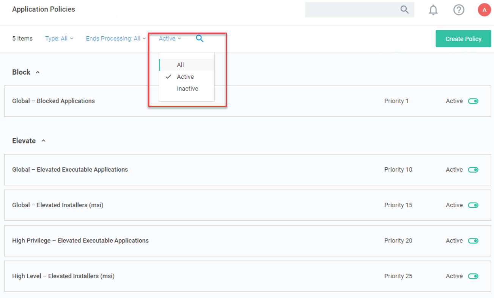

.. _m8:

---------------------------------------
Creating Community Specific Policy Sets
---------------------------------------

Overview
------------

This module will cover:

1. Creating user context filters
2. Creating policy tied to user context filters
3. UAC replacement
4. Whitelisting
5. Catch all policy

Introduction
------------

In the previous module we created a set of policies to block and elevate specific applications for all users, regardless of the type of user. This is a common approach to ensuring that if an application is corporately approved or disapproved it can quickly be targeted within a policy that will be applied to **every** user. 

| It is also common that within an organization there are different communities of users that have vastly different requirements, for example

- Developers
- IT Systems Engineers
- Finance Teams
- Sales Teams
- Etc.

A "one size fits all" approach is unlikely to give these different communities of users the right balance of flexibility and security that an organization needs. For this reason, we can create specific policy sets that are then targeted to different communities using **User Context Filtering**. User context filters can be created to target Active Directory or Azure Active Directory groups (from AD Sync or manually defining group SID) or by targeting individual users. 

| In the lab exercises within this module we will be grouping different user communities into two levels, users that typically require high levels of flexibility in terms of application elevation and execution such as Developers and IT Admins and users that require lower levels of privilege as they typically use a static set of applications to perform their job function. In a production environment, as many community policy sets can be created as are required although it does need to be a consideration of manageability. *The more policies that exist, the greater the management overhead*. 

User Context Filters
--------------------

As mentioned previously User context filtering provides the ability to apply policies to specific domain security groups or even to specific users. This is normally achieved by targeting groups synced from Active Directory or Azure Active Directory but can also be achieved by manually targeting a group SID (Security Identifier)

Lab 18 - Creating User Context Filters
**************************************

In this exercise we will create two user context filters for High Privilege Users and Low Privilege users.

#. Switch to SSPM
#. In the Privilege Manager UI, navigate to **Admin -> Filters**

Creating High Level User Context Filter
^^^^^^^^^^^^^^^^^^^^^^^^^^^^^^^^^^^^^^^

#. Click **Create Filter**
#. In the **Platform/Location** field, select **Windows Computers Filters**
#. In the **Type** field, select **User Context Filter**
#. **Name** field, type **High Privilege User Context Filter**
#. In the **Description** field type **Filter used to target AD Security groups and users that require high levels of privilege**
#. Click **Create**
#. Click in **Settings** section in the line **Domain User Groups** the **Add** text
#. Click **Search**
#. Search and add the following groups:
   
   - Development Team
   - IT Engineering Team

#. Click **Select** 
#. Click **Save Changes**
#. The top of the filter should look roughly like the below screenshot

   .. figure:: images/lab-pv-001.png

Creating Low Level User Context Filter
^^^^^^^^^^^^^^^^^^^^^^^^^^^^^^^^^^^^^^

Rather than creating another user context filter from scratch, a duplicate of the first filter can be created and modified to save time

#. While still in the *High Privilege User Context Filter*, click *More > Duplicate*
#. Change the name to **Low Privilege User Context Filter**
#. Click **Create**
#. Change the Description as well to reflect the Low Privilege User
#. Remove the two Groups that have been assigned by clicking the **X** behind their names.
#. Click in **Settings** section in the line **Domain User Groups** the **Add** text
#. Click **Search**
#. Search and add the following groups:
   
   - Finance Team
   - Sales Team

#. Click **Select** 
#. Click **Save Changes**
#. The top of the filter should look roughly like the below screenshot

   .. figure:: images/lab-pv-002.png

Both filters are now available to be used by policies

Community Specific Policy Overview
----------------------------------

As previously mentioned there are many ways to create effective policy sets, this section is not intended to provide a "Correct" way of deploying policy but a suggestion of a well-structured policy set that achieves most use cases in typical deployments of endpoint privilege management.

| We have previously defined three **Global** policies

- Global Blocked Applications
- Global Elevated Executable Applications 
- Global Elevated Installers (msi)

In the following lab exercises we will be adding additional policies that will be specific to a community or communities of users. 

- High Privilege Elevated Executable Applications 
  
  - This policy is the same as the global version but allows elevation of applications that are only used by users within the targeted community

- High Privilege Elevated Installers (msi)

  - This policy is the same as the global version but allows elevation of installers that are only used by users within the targeted community

- High Privilege Restricted Applications

  - This policy targets high risk windows applications such as scripting engines that we might want to treat more restrictively than other applications for the targeted community 

- High Privilege UAC Replacement

  - This policy provides a broad policy that targets any application that generates a UAC prompt for the targeted community

- High Privilege Whitelist

  - This policy targets any application with Trusted Ownership for the targeted community

- High Privilege Catchall 

  - This policy targets any application that has not matched against any other policy for the targeted community 

Lab 19 - Creating High Privilege Elevated Application and Installer policies
****************************************************************************

In this exercise we will copy and modify the existing elevation policies rather than building them from scratch, this can often by a great time saving approach when creating policies that are very similar to an existing policy.

High Privilege – Elevated Executable Applications
^^^^^^^^^^^^^^^^^^^^^^^^^^^^^^^^^^^^^^^^^^^^^^^^^

#. Navigate to **WINDOW COMPUTERS group > Application Policies**
#. Open the **Global – Elevated Executable Applications** policy
#. Click *More > Duplicate*
#. Change the name to **High Privilege – Elevated Executable Applications**
#. Click **Create**
#. Set the policy priority to 20
#. In the **Conditions** section; **Inclusions** click **Add Inclusions**
#. Search **High Privilege User Context Filter** and add it

   .. note::
       If the filter is not shown, press the refresh button, next to the **X** sign in the window

#. Click **Update**
#. Click **Save Changes**
#. Activate the policy by clicking **Inactive**

High Privilege – Elevated Installers (msi)
^^^^^^^^^^^^^^^^^^^^^^^^^^^^^^^^^^^^^^^^^^

#. Navigate to **WINDOW COMPUTERS group > Application Policies**
#. Open the **Global – Elevated Installers (msi)** policy
#. Click *More > Duplicate*
#. Change the name to **High Privilege – Elevated Installers (msi)**
#. Click **Create**
#. Set the policy priority to 25
#. In the **Conditions** section; **Inclusions** click **Edit** (leave the rest as is)
#. Search **High Privilege User Context Filter** and add it

   .. note::
       If the filter is not shown, press the refresh button, next to the **X** sign in the window

#. Click **Update**
#. Click **Save Changes**
#. Activate the policy by clicking **Inactive**

Your policy set in the **WINDOW COMPUTERS group > Application Policies** should now match the below image when sorted by policy priority and filtered to only show enabled policies (use the Filter option left of the lowest Magnifier Glass and set **All to Active**)

Restricted Applications
-----------------------

In the policy set we are creating there will be a general policy that captures any application that generates a Windows User Account Control Prompt, with Privilege Manager we can replace this standard UAC behavior with a customized experience which can be very flexible (warning message) or more restrictive to the user (justification prompt or approval workflow).

| In many cases, there may be some applications that we want to treat differently to the applications that hit our general UAC replacement. For example, highly powerful, potentially risky applications such as scripting engines (wscript, cscript, powershell, cmd.exe etc.) we may want to handle more restrictively than other applications

| As Privilege Manager policies are applied in priority order, if we want to catch applications before they hit the UAC replacement policy the policy needs to have a lower priority value. 

| In the following lab exercise we will create a policy to target applications we want to treat differently (typically more restrictively) than applications hitting the UAC replacement policy. 

Lab 20 - Creating a Restricted Applications Policy
**************************************************

#. Navigate to **WINDOW COMPUTERS group > Application Policies**
#. Click **Create Policy**
#. Click **Skip the wizard, take me to a blank policy** as we want to control all steps and options ourselves
#. Use the following parameters for the fields shown:

   - **Name:** High Privilege – Restricted Applications
   - **Description:** This policy targets high risk windows applications 
   - **Priority:** 30

#. Click **Create Policy** and let's populate the needed fields so we create our policy
#. Under **Conditions** section, click **Applications Targeted** click **Add Applications Targeted**
#. Add the following from the list on the left hand side:

   - Command Processor (cmd.exe)
   - Microsoft Management Console (mmc.exe)
   - PowerShell (powershell.exe)
   - Scripting Host (cscript.exe)
   - Scripting Host (wscript.exe)

#. Click **Update**
#. Under **Conditions** section, click **Add Inclusions** and add:

   - High Privilege User Context Filter
   - User Access Control Consent Dialog Detected

#. Click **Update**
#. Under **Conditions** section, click **Add Exclusions** and add the Administrators Group this ensures we won’t try to elevate applications for users that are already administrators. This would not technically cause a problem but is a logical best practice
#. Click **Update**
#. Under **Actions** section, click **Add Actions** and add:

   - Add Administrative Rights
   - Justify Application Elevation Action

#. Click **Update**
#. Under **Actions** section, click **Add Child Actions** and add the **Add Administrative Rights**
#. Click **Update**
#. Make sure that the **Audit Policy Events** is enabled
#. Click **Enable**
#. Click **Show Advanced** text and make sure only **Continue Enforcing Policies for Child Processes** is toggled on
#. Click **Save Changes**
#. The policy should look like the below (with respect to Conditions, Actions and Policy Enforcement)

   .. figure:: images/lab-pv-004.png

#. Activate the policy by clicking **Inactive**

.. raw:: html

    

    <H2 style="color:#80BB01">This concludes this module
    

