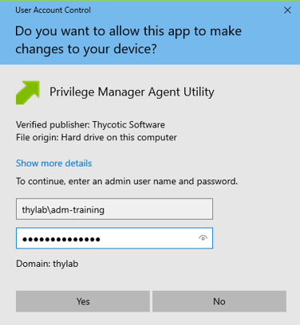
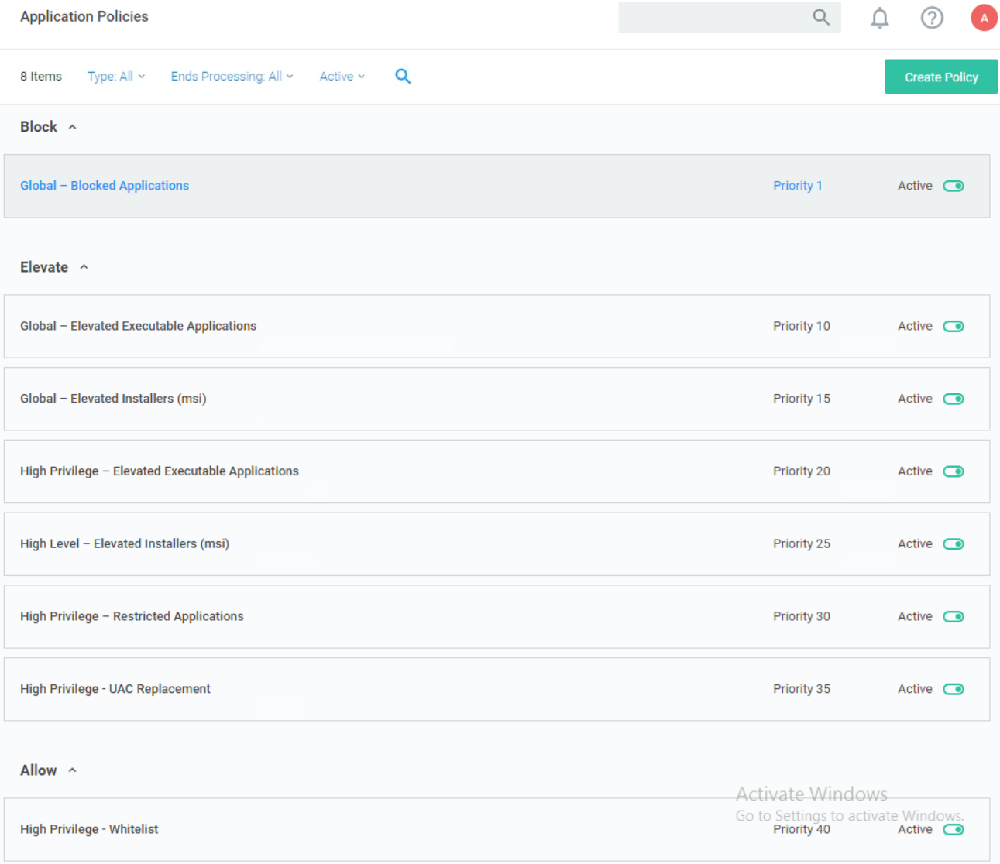

.. _m8:

---------------------------------------
Creating Community Specific Policy Sets
---------------------------------------

Overview
------------

This module will cover:

1. Creating user context filters
2. Creating policy tied to user context filters
3. UAC replacement
4. Whitelisting
5. Catch all policy

Introduction
------------

In the previous module we created a set of policies to block and elevate specific applications for all users, regardless of the type of user. This is a common approach to ensuring that if an application is corporately approved or disapproved it can quickly be targeted within a policy that will be applied to **every** user. 

| It is also common that within an organization there are different communities of users that have vastly different requirements, for example

- Developers
- IT Systems Engineers
- Finance Teams
- Sales Teams
- Etc.

A "one size fits all" approach is unlikely to give these different communities of users the right balance of flexibility and security that an organization needs. For this reason, we can create specific policy sets that are then targeted to different communities using **User Context Filtering**. User context filters can be created to target Active Directory or Azure Active Directory groups (from AD Sync or manually defining group SID) or by targeting individual users. 

| In the lab exercises within this module we will be grouping different user communities into two levels, users that typically require high levels of flexibility in terms of application elevation and execution such as Developers and IT Admins and users that require lower levels of privilege as they typically use a static set of applications to perform their job function. In a production environment, as many community policy sets can be created as are required although it does need to be a consideration of manageability. *The more policies that exist, the greater the management overhead*. 

User Context Filters
--------------------

As mentioned previously User context filtering provides the ability to apply policies to specific domain security groups or even to specific users. This is normally achieved by targeting groups synced from Active Directory or Azure Active Directory but can also be achieved by manually targeting a group SID (Security Identifier)

Lab 18 - Creating User Context Filters
**************************************

In this exercise we will create two user context filters for High Privilege Users and Low Privilege users.

#. Switch to SSPM
#. In the Privilege Manager UI, navigate to **Admin -> Filters**

Creating High Level User Context Filter
^^^^^^^^^^^^^^^^^^^^^^^^^^^^^^^^^^^^^^^

#. Click **Create Filter**
#. In the **Platform/Location** field, select **Windows Computers Filters**
#. In the **Type** field, select **User Context Filter**
#. **Name** field, type **High Privilege User Context Filter**
#. In the **Description** field type **Filter used to target AD Security groups and users that require high levels of privilege**
#. Click **Create**
#. Click in **Settings** section in the line **Domain User Groups** the **Add** text
#. Click **Search**
#. Search and add the following groups:
   
   - Development Team
   - IT Engineering Team

#. Click **Select** 
#. Click **Save Changes**
#. The top of the filter should look roughly like the below screenshot

   .. figure:: images/lab-pv-001.png

Creating Low Level User Context Filter
^^^^^^^^^^^^^^^^^^^^^^^^^^^^^^^^^^^^^^

Rather than creating another user context filter from scratch, a duplicate of the first filter can be created and modified to save time

#. While still in the *High Privilege User Context Filter*, click *More > Duplicate*
#. Change the name to **Low Privilege User Context Filter**
#. Click **Create**
#. Change the Description as well to reflect the Low Privilege User
#. Remove the two Groups that have been assigned by clicking the **X** behind their names.
#. Click in **Settings** section in the line **Domain User Groups** the **Add** text
#. Click **Search**
#. Search and add the following groups:
   
   - Finance Team
   - Sales Team

#. Click **Select** 
#. Click **Save Changes**
#. The top of the filter should look roughly like the below screenshot

   .. figure:: images/lab-pv-002.png

Both filters are now available to be used by policies

Community Specific Policy Overview
----------------------------------

As previously mentioned there are many ways to create effective policy sets, this section is not intended to provide a "Correct" way of deploying policy but a suggestion of a well-structured policy set that achieves most use cases in typical deployments of endpoint privilege management.

| We have previously defined three **Global** policies

- Global Blocked Applications
- Global Elevated Executable Applications 
- Global Elevated Installers (msi)

In the following lab exercises we will be adding additional policies that will be specific to a community or communities of users. 

- High Privilege Elevated Executable Applications 
  
  - This policy is the same as the global version but allows elevation of applications that are only used by users within the targeted community

- High Privilege Elevated Installers (msi)

  - This policy is the same as the global version but allows elevation of installers that are only used by users within the targeted community

- High Privilege Restricted Applications

  - This policy targets high risk windows applications such as scripting engines that we might want to treat more restrictively than other applications for the targeted community 

- High Privilege UAC Replacement

  - This policy provides a broad policy that targets any application that generates a UAC prompt for the targeted community

- High Privilege Whitelist

  - This policy targets any application with Trusted Ownership for the targeted community

- High Privilege Catchall 

  - This policy targets any application that has not matched against any other policy for the targeted community 

Lab 19 - Creating High Privilege Elevated Application and Installer policies
****************************************************************************

In this exercise we will copy and modify the existing elevation policies rather than building them from scratch, this can often by a great time saving approach when creating policies that are very similar to an existing policy.

High Privilege – Elevated Executable Applications
^^^^^^^^^^^^^^^^^^^^^^^^^^^^^^^^^^^^^^^^^^^^^^^^^

#. Navigate to **WINDOW COMPUTERS group > Application Policies**
#. Open the **Global – Elevated Executable Applications** policy
#. Click *More > Duplicate*
#. Change the name to **High Privilege – Elevated Executable Applications**
#. Click **Create**
#. Set the policy priority to 20
#. In the **Conditions** section; **Inclusions** click **Add Inclusions**
#. Search **High Privilege User Context Filter** and add it

   .. note::
       If the filter is not shown, press the refresh button, next to the **X** sign in the window

#. Click **Update**
#. Click **Save Changes**
#. Activate the policy by clicking **Inactive**

High Privilege – Elevated Installers (msi)
^^^^^^^^^^^^^^^^^^^^^^^^^^^^^^^^^^^^^^^^^^

#. Navigate to **WINDOW COMPUTERS group > Application Policies**
#. Open the **Global – Elevated Installers (msi)** policy
#. Click *More > Duplicate*
#. Change the name to **High Privilege – Elevated Installers (msi)**
#. Click **Create**
#. Set the policy priority to 25
#. In the **Conditions** section; **Inclusions** click **Edit** (leave the rest as is)
#. Search **High Privilege User Context Filter** and add it

   .. note::
       If the filter is not shown, press the refresh button, next to the **X** sign in the window

#. Click **Update**
#. Click **Save Changes**
#. Activate the policy by clicking **Inactive**

Your policy set in the **WINDOW COMPUTERS group > Application Policies** should now match the below image when sorted by policy priority and filtered to only show enabled policies (use the Filter option left of the lowest Magnifier Glass and set **All to Active**)

Restricted Applications
-----------------------

In the policy set we are creating there will be a general policy that captures any application that generates a Windows User Account Control Prompt, with Privilege Manager we can replace this standard UAC behavior with a customized experience which can be very flexible (warning message) or more restrictive to the user (justification prompt or approval workflow).

| In many cases, there may be some applications that we want to treat differently to the applications that hit our general UAC replacement. For example, highly powerful, potentially risky applications such as scripting engines (wscript, cscript, powershell, cmd.exe etc.) we may want to handle more restrictively than other applications

| As Privilege Manager policies are applied in priority order, if we want to catch applications before they hit the UAC replacement policy the policy needs to have a lower priority value. 

| In the following lab exercise we will create a policy to target applications we want to treat differently (typically more restrictively) than applications hitting the UAC replacement policy. 

Lab 20 - Creating a Restricted Applications Policy
**************************************************

#. Navigate to **WINDOW COMPUTERS group > Application Policies**
#. Click **Create Policy**
#. Click **Skip the wizard, take me to a blank policy** as we want to control all steps and options ourselves
#. Use the following parameters for the fields shown:

   - **Name:** High Privilege – Restricted Applications
   - **Description:** This policy targets high risk windows applications 
   - **Priority:** 30

#. Click **Create Policy** and let's populate the needed fields so we create our policy
#. Under **Conditions** section > **Applications Targeted** click **Add Applications Targeted**
#. Add the following from the list on the left hand side:

   - Command Processor (cmd.exe)
   - Microsoft Management Console (mmc.exe)
   - PowerShell (powershell.exe)
   - Scripting Host (cscript.exe)
   - Scripting Host (wscript.exe)

#. Click **Update**
#. Under **Conditions** section, click **Add Inclusions** and add:

   - High Privilege User Context Filter
   - User Access Control Consent Dialog Detected

#. Click **Update**
#. Under **Conditions** section, click **Add Exclusions** and add the Administrators Group this ensures we won’t try to elevate applications for users that are already administrators. This would not technically cause a problem but is a logical best practice
#. Click **Update**
#. Under **Actions** section, click **Add Actions** and add:

   - Add Administrative Rights
   - Justify Application Elevation Action

#. Click **Update**
#. Under **Actions** section, click **Add Child Actions** and add the **Add Administrative Rights**
#. Click **Update**
#. Make sure that the **Audit Policy Events** is enabled
#. Click **Enable**
#. Click **Show Advanced** text and make sure only **Continue Enforcing Policies for Child Processes** is toggled on
#. Click **Save Changes**
#. The policy should look like the below (with respect to Conditions, Actions and Policy Enforcement)

   .. figure:: images/lab-pv-004.png

#. Activate the policy by clicking **Inactive**

UAC Replacement
---------------

Within the Windows (and Server) environment, the vast majority of applications that require elevated rights to install or function will generate a Windows User Account Control (UAC) prompt

For standard users, that do not possess an administrative credential, Windows UAC does not provide a useful mechanism for elevation as the user has no way of elevating the application or requesting an elevation.

| With Privilege Manager we can completely replace this standard UAC functionality with a customized messaging experience that is as flexible or restrictive as is required. UAC messages can be replaced with the following user experience:
  
- **Silently Elevated** – not recommended
- **Elevation Warning Message** – Can be used to provide a ‘Pseudo’ Admin experience
- **Elevation Justification Message** – Can be used to collect data about why users are running applications that require elevated rights
- **Approval Workflow** – Used to ensure users cannot elevate or install applications requiring administrative rights, without gaining approval from a support team or manager

| Different customers may want to apply different types of experience to different communities of user, in our example policy set we will be applying the following:
  
- High Privilege Users – Elevation Warning Message for UAC replacement
- Low Privilege Users – Approval Workflow Message for UAC replacement

.. note:: 
   A key consideration is the volume of elevations and installations we expect from a given user community, for example if we applied an approval workflow to developers and they need to elevate or install 20 applications a week, this would create a poor user experience for the user and generate a large workload for the support team. 

Lab 21 - Creating a UAC Replacement Policy
******************************************

Create the UAC replacement policy
^^^^^^^^^^^^^^^^^^^^^^^^^^^^^^^^^

#. Navigate to **WINDOW COMPUTERS group > Application Policies**
#. Click **Create Policy**
#. Click **Skip the wizard, take me to a blank policy** as we want to control all steps and options ourselves
#. Use the following parameters for the fields shown:

   - **Name:** High Privilege – UAC Replacement
   - **Description:** This policy replaces UAC with custom messaging 
   - **Priority:** 35

#. Click **Create Policy** and let's populate the needed fields so we create our policy
#. Under **Conditions** section > **Applications Targeted** click **Add Applications Targeted**
#. Add the following from the list on the left hand side (all are available out-of-the-box):

   - COM Elevation Host (COMElevateHost.exe)
   - Microsoft Installer File Filter
   - Require Administrator Rights Manifest Filter
   - User Access Control Consent Dialog Detected

   .. figure:: images/lab-pv-005.png

#. Click **Update**
#. Under **Conditions** section, click **Add Inclusions** and add:

   - High Privilege User Context Filter

#. Click **Update**
#. Under **Conditions** section, click **Add Exclusions** and add the Administrators Group this ensures we won’t try to elevate applications for users that are already administrators. This would not technically cause a problem but is a logical best practice
#. Click **Update**
#. Under **Actions** section, click **Add Actions** and add:

   - Add Administrative Rights
   - Application Warning Message Action

#. Click **Update**
#. Under **Actions** section, click **Add Child Actions** and add the **Add Administrative Rights**
#. Click **Update**
#. Make sure that the **Audit Policy Events** is enabled
#. Click **Enable**
#. Click **Save Changes**

#. The policy should look like the below (with respect to Conditions, Actions)

   .. figure:: images/lab-pv-006.png

#. Activate the policy by clicking **Inactive**

Test the restricted application and UAC replacement policy
^^^^^^^^^^^^^^^^^^^^^^^^^^^^^^^^^^^^^^^^^^^^^^^^^^^^^^^^^^

#. Log onto the client machine **CLIENT01** as **Developer** / *Password provided by trainer*
#. Start the **Agent Utility** and click **Update** (as the Developer account is part of the High Privilege User Context Polic, no UAC is shown..)
#. The newly created policies should be shown
#. Download and run an executable installer of your choice (notepad ++ for example in the Example Applications), you should see a warning message, but you will be able to proceed with the elevation

   .. figure:: images/lab-pv-008.png  

#. Right click notepad and click Run as Administrator, you should see the warning message 
#. Right click PowerShell and click Run as Administrator, you should see the justification message, enter a reason, and proceed with the elevation. 

   .. figure:: images/lab-pv-009.png  

Whitelisting
------------

The next policy in our set will be an application whitelist, this is a policy designed to catch and allow applications users need to perform their job role that do not require admin rights. In this module we will be deploying **Trusted File Owners** based whitelisting. This approach uses the concept of allowing or "Trusting" applications that are owned at the file level by one of the following accounts/groups:

- System – This makes sure that Privilege Manager seamlessly allows System Processes to run. Most software deployment tools such as SCCM install applications under the System context, so this also ensures that applications deployed via SCCM are typically whitelisted. 
- Trusted Installer – The vast majority of native Microsoft applications are owned by this account. This ensures these applications will run seamlessly 
- Administrators Group – If an application is installed via a Privilege Manager elevated process, they will be owned by the Administrators group therefore this entry makes sure the application will be whitelisted following the installation.

.. note:: 
   The list of trusted accounts can be modified, this allows organizations to create users or groups of users who are effectively "Approved Installers" and can install applications that will automatically be whitelisted for other users. We are going to perform this by using User Context Filters

Lab 21 - Creating a Trusted Installers Whitelisting policy
**********************************************************

This policy is dependent on a filter which needs to be built first and then can be used in the whitlisting policy

Create the needed filter
^^^^^^^^^^^^^^^^^^^^^^^^

#. Switch to SSPM
#. In the Privilege Manager UI, navigate to **Admin -> Filters**
#. Click **Create Filter**
#. In the **Platform/Location** field, select **Windows Computers Filters**
#. In the **Type** field, select **User Context Filter**
#. **Name** field, type **Trusted File Owners**
#. In the **Description** field type **Filter used to target account that are trusted as owners of files**
#. Click **Create**
#. Click in **Settings** section in the line **Built-in Accounts** the **Add** text
#. Search and add the following groups:
   
   - Administrators
   - Domain Administrators

#. Click **Select** 
#. Click in **Settings** section in the line **Well-known Accounts** the **Add** text
#. Search and add the following accounts:
   
   - NT Authority System Account
   - Trusted Installer

#. Click **Save Changes**
#. The top of the filter should look roughly like the below screenshot

   .. figure:: images/lab-pv-010.png

Build the whitelisting policy
^^^^^^^^^^^^^^^^^^^^^^^^^^^^^

#. Navigate to **WINDOW COMPUTERS group > Application Policies**
#. Click **Create Policy**
#. Click **Skip the wizard, take me to a blank policy** as we want to control all steps and options ourselves
#. Use the following parameters for the fields shown:

   - **Name:** High Privilege – Whitelist
   - **Description:** This policy whitelists all for Trusted Installers for High Privilege users 
   - **Priority:** 40

#. Click **Create Policy** and let's populate the needed fields so we create our policy
#. Under **Conditions** section, click **Add Inclusions** and add:

   - Trusted File Owners (the just created filter)

     .. note::
        The built-in filter *Trusted Installer File Owner Filter* is not to be used! This is the out-of-the-box version and Read Only...

#. Click **Update**
#. Leave Actions empty as we don;t want anything to happen if this policy hits.
#. Click **Save Changes**
#. The policy should look like the below (with respect to Conditions, Actions)

   .. figure:: images/lab-pv-011.png

#. Activate the policy by clicking **Inactive**

Catch All Policy
----------------

If we look at our overall policy set that now exists (filtered on Active only):

The policies all contain specific application conditions. This means the above policies will only apply if those conditions are met. So, importantly, we need to consider a scenario where an application runs that does not meet any of these policies. 

| The way to handle this scenario is to create a catch all policy as the final policy for the targeted community. This approach will be familiar to those with experience of firewall rules and means that we will create a scenario where it is impossible to run an application without, at the very least, it being caught by our catch all. 

Create the Catch-All policy
***************************

#. Switch back to SSPM
#. Navigate to **WINDOW COMPUTERS group > Application Policies**
#. Click **Create Policy**
#. Click **Monitoring** and click **Next Step**
#. Click **Everything** and click **Next Step**
#. Use the following parameters for the fields:

   - **Name:** High Privilege – Catch All
   - **Description:** This policy catches any application not previously matched
   - **Priority:** 45

#. Click **Create Policy**

Now we need to make some changes to the create policy

#. Under **Conditions** section, click **Add Inclusions** and add **High Privilege User Context Filter** 
#. Under **Conditions** section, **Exclusions** click **Edit** and remove all
#. Click **Update**
#. Under **Actions** section, click **Add Actions** and add **Application Warning Message Action**
#. Click **Update**
#. Make sure that the **Audit Policy Events** is enabled
#. Click **Enable**
#. Click **Save Changes**
#. Activate the policy by clicking the **Inactive** toggle switch

Test the Catch-All policy
*************************

#. Log onto the client machine **CLIENT01** as **Developer** / *Password provided by trainer*
#. Open the Agent Utility and click **Update** so we get the newly create policy on the client
#. Run notepad.exe / paint.exe / cmd.exe without elevation, thy should run seamlessly because they are owned by the Trusted Installer Account. You can see this by right clicking the application in explorer and viewing the advanced security information (notepad.exe as example):

   .. figure:: images/lab-pv-013.png

#. Close all open window till you see the desktop again.
#. Now go to https://www.chiark.greenend.org.uk/~sgtatham/putty/latest.html (or use Google to find it) 
#. You will see that the putty ssh application is available as a MSI installer (if we install this it will trigger the UAC replacement) or as a binary (portable .exe that does not need to be installed to be executed). **Download the binary .exe file!**. 
#. Navigate to the downloads directory and right-click the application. Navigate to the advanced security information. You will see that the file is owned by the Developer user. This account is not one of the trusted accounts and therefore the application when executed, should hit our catch all policy and show a warning screen. In our example we have are allowing High Privilege users to run unknown applications like this, for other users we would present an **Approval Workflow**

What is shown in the UI?
************************

As we have the **Audit Policy Events** enabled let's see what that means in the Privilege Manager UI.

#. Switch back to SSPM
#. Navigate to **WINDOW COMPUTERS group > Application Policies**
#. Open the **High Privilege – Catch All** policy
#. Click the **Policy Events** tab
#. Besides putty you will also see other applications that have been opened that were not caught by other policies for the Developer user.

   .. figure:: images/lab-pv-014.png

Creating a Low Privilege Users policy set
-----------------------------------------

As we have already created a complete policy set for our high privilege users, we can duplicate these policies and make minor changes to quickly accommodate Low Privilege Users. To do this, simply duplicate each of the High Privilege Policies and rename to Low Privilege. 

.. note::
   *PRO TIP* Right click the links of the policy and select *open in a new tab* in the browser, it saves time in switching back and forth...

The Priority for each Low Privilege policy needs to be edited as well. Use the below table to get the priority

.. list-table::
    :widths: 90 10
    :header-rows: 1

    * - Policy name
      - Priority
    * - Low Privilege - Elevated Executable Applications
      - 50
    * - Low Privilege - Elevated Installers (msi)
      - 55
    * - Low Privilege - Restricted Applications
      - 60
    * - Low Privilege - UAC Replacement
      - 65
    * - Low Privilege - Whitelist
      - 69
    * - Low Privilege - Catch All
      - 70

The following also needs to be changed for **ALL** Low Privilege policies:

- Under **Conditions**, if **Inclusions** includes *High Privilege User Context Filter*, click **Edit** remove the *High Privilege User Context Filter* and add *Low Privilege User Context Filter*, click **Update**
- Under **Conditions**, if **Exclusions** does not include *Administrators*, click **Add Exclusions** or **Edit** and add *Administrators*, click **Update**
- Under **Actions**, **Actions** click **Edit** and add the **Approval Request (With Offline Fallback) Form Action**, click **Update**

  .. warning::
      For the *Low Privilege - Whitelist* and the *Low Privilege - Catch All* policies **DO NOT** add the **Approval Request (With Offline Fallback) Form Action** to the Actions. This will trigger a lot of Approval requests and makes working with the client as a Low Privilege User impossible

      | For the *Low Privilege - Restricted Applications* remove the *Justify application Elevation Action*. This has been exchanged by the *Approval* process

- **Save Changes**
- Activate the policy by clicking **Inactive**
- Repeat for all Polices

.. note::
   *PRO TIP* Right click the links of the policy and open in a new tab in the browser, it saves time in switching back and forth...

Testing the Low Privilege policies
**********************************

#. While still being logged in as Developer, open the Agent Utility and click **Update** so we get the newly create policy on the client
#. Logout and log back in as **SalesUser** / *Password provided by trainer*
#. Right click PowerShell.exe and click Run as Administrator
#. You will need to submit an approval request reason and click Continue

   .. figure:: images/lab-pv-015.png

   .. note::
      If two screens with respect to *Approval* are popping up, make sure that in the **Low Privilege - Restricted** and the **Low Privilege- UAC Replacement** Policies, the option **Continue Enforcing polices** is checked off

#. Go back to the Privilege Manager Console, and navigate to the approvals area via **Admin > Manage Approvals**
#. Click the Pending Approval Requests** this will show the reason the user has provided and the option to perform one-time elevation or time-based elevation

   .. figure:: images/lab-pv-016.png

#. Click **Approve** 
#. Keep **One Time** selected and click **Approve**

   .. figure:: images/lab-pv-017.png

#. Go back to the client machine, 
#. The application notice window should have refreshed automatically, if not click Refresh

   .. figure:: images/lab-pv-019.png

#. Click Continue, you now have an elevated PowerShell instance 

.. note:: 
   As a stretch exercise: Disable the network adapter and retry the above exercise. As there is no internet connection the user will have a challenge code generated. From the Privilege Manager console, go to Tools > Offline approvals to generate a response code. The user can enter the response code to execute or elevate an application even if they do not have a network/internet connection. 

.. raw:: html

    

    <H2 style="color:#80BB01">This concludes this module
    

